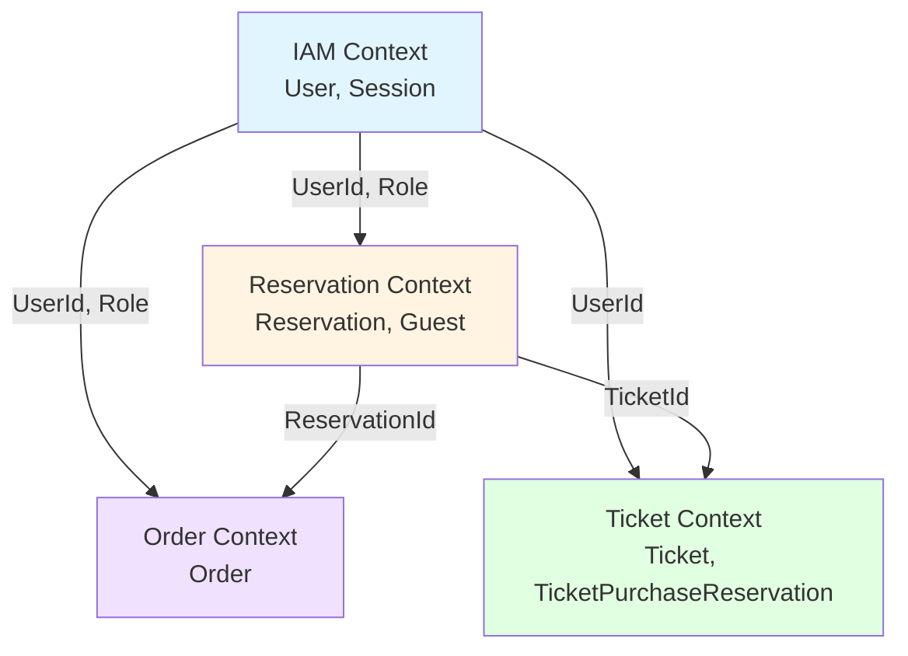

# Lunch Hub アーキテクチャ設計

## 概要

Lunch Hubは、社内の弁当注文を管理するWebアプリケーションです。DDDとクリーンアーキテクチャの原則に従い、保守性と拡張性の高いシステムを構築します。

## レイヤー構造

```
┌─────────────────────────────────────────────┐
│ Presentation Layer (UI/API)                │
│ - React Frontend                            │
│ - NestJS REST API Controllers               │
│ - DTOs, Guards, Middleware                  │
└────────────────┬────────────────────────────┘
                 │
┌────────────────▼────────────────────────────┐
│ Application Layer (Use Cases)              │
│ - InviteUserUseCase                         │
│ - CreateReservationUseCase                  │
│ - PlaceOrderUseCase                         │
│ - PurchaseTicketUseCase                     │
└────────────────┬────────────────────────────┘
                 │
┌────────────────▼────────────────────────────┐
│ Domain Layer                                │
│ Aggregates:                                 │
│ - User (IAM + Profile)                      │
│ - Reservation                               │
│ - Order                                     │
│ - Ticket                                    │
│ - Guest                                     │
│ - Session                                   │
│                                             │
│ Domain Services, Events, Value Objects      │
└────────────────┬────────────────────────────┘
                 │
┌────────────────▼────────────────────────────┐
│ Infrastructure Layer                        │
│ - PostgreSQL (TypeORM)                      │
│ - Redis (Session, Cache)                    │
│ - Email Service (Nodemailer/SendGrid)       │
│ - File Storage                              │
└─────────────────────────────────────────────┘
```

## 技術選定の理由

### Backend: NestJS
- **理由**: DDDとクリーンアーキテクチャの実装に適したモジュール構造を持つ
- **代替案**: Express（構造が自由すぎる）、Fastify（エコシステムが小さい）

### Frontend: React + Vite
- **理由**: コンポーネント指向でUIの再利用性が高い。Viteにより高速な開発体験
- **代替案**: Vue（チームの経験が少ない）、Next.js（SSRは不要）

### Database: PostgreSQL + Redis
- **PostgreSQL**: トランザクション整合性が重要な業務データに適する
- **Redis**: セッション管理とキャッシュに高速なインメモリストアが必要

### ORM: TypeORM
- **理由**: NestJSとの統合が良好。TypeScriptのデコレータでエンティティを定義できる
- **代替案**: Prisma（マイグレーション管理の柔軟性が低い）

## 境界づけられたコンテキスト (Bounded Contexts)

### 1. Identity and Access Management Context (IAM)
**責務**: ユーザー認証・認可

**集約**:
- User (認証情報 + プロフィール)
- Session

**主要ユースケース**:
- ユーザー招待
- アカウントアクティベーション
- ログイン・ログアウト
- パスワード管理

---

### 2. Reservation Management Context
**責務**: 弁当予約の管理

**集約**:
- Reservation
- Guest

**主要ユースケース**:
- 予約作成
- 予約変更
- 予約キャンセル
- ゲスト予約作成(係のみ)

---

### 3. Order Management Context
**責務**: 注文の取りまとめと発注

**集約**:
- Order

**主要ユースケース**:
- 注文集計
- 注文確定
- 注文履歴確認

---

### 4. Ticket Management Context
**責務**: チケットの購入と管理

**集約**:
- Ticket
- TicketPurchaseReservation

**主要ユースケース**:
- チケット購入予約
- チケット使用
- チケット残高確認

---

## コンテキストマッピング



**統合パターン**:
- **Shared Kernel**: UserId, Role, DisplayName, EmailAddress
- **Customer-Supplier**: IAM → 他のコンテキスト(UserIdを提供)
- **Partnership**: Reservation ↔ Ticket(チケット払いの予約)
