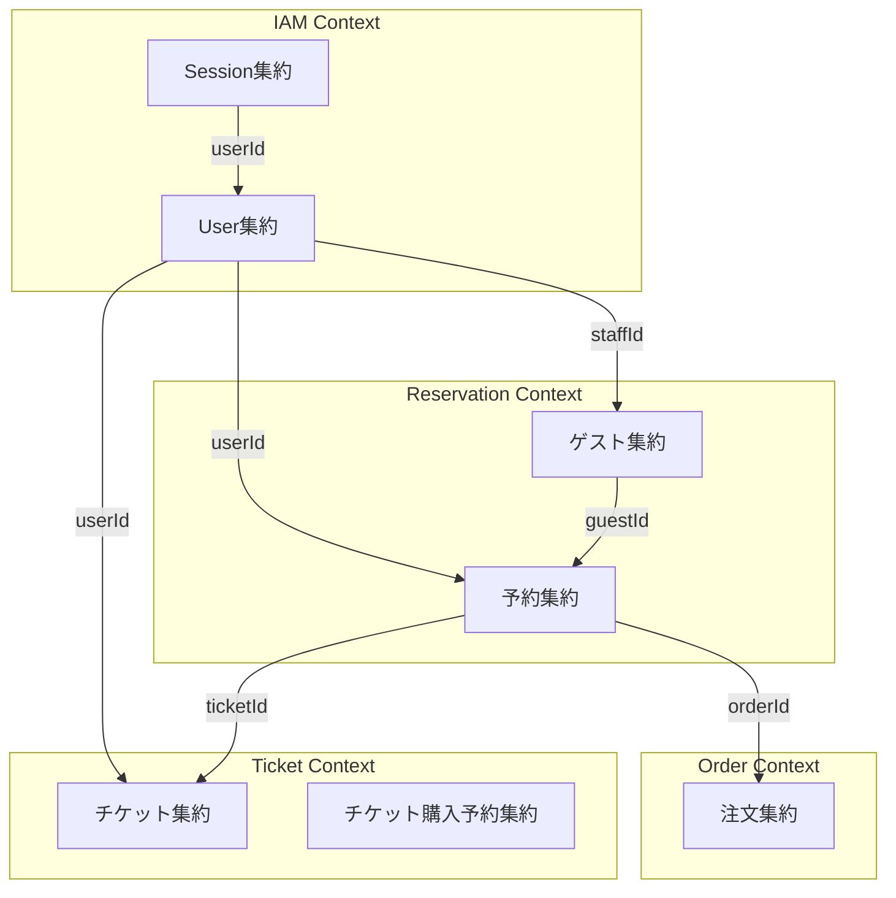
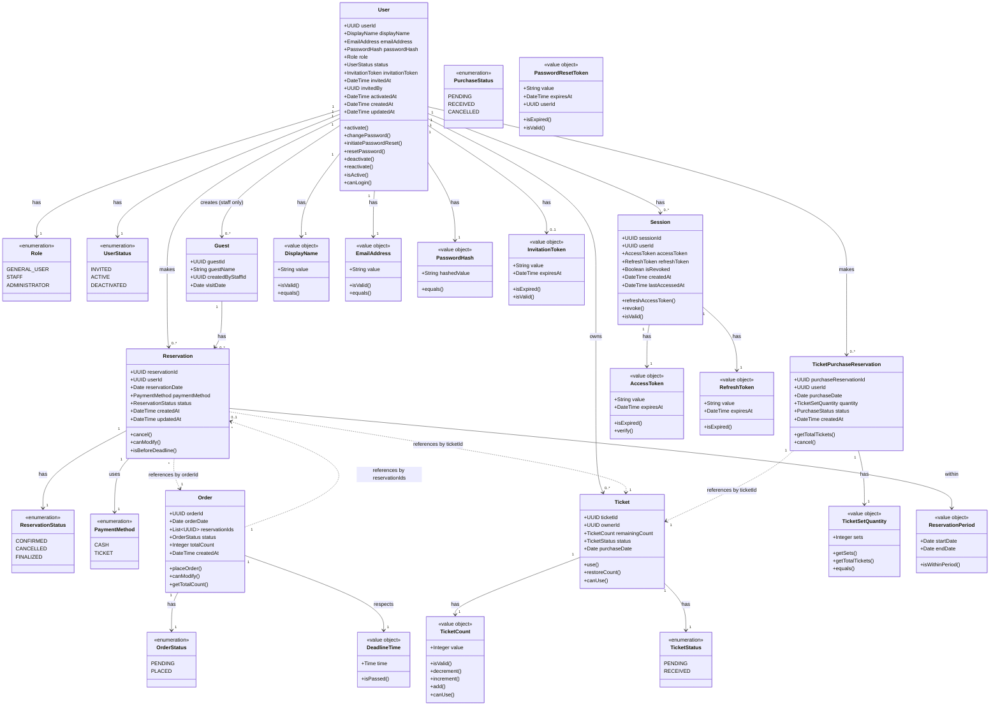
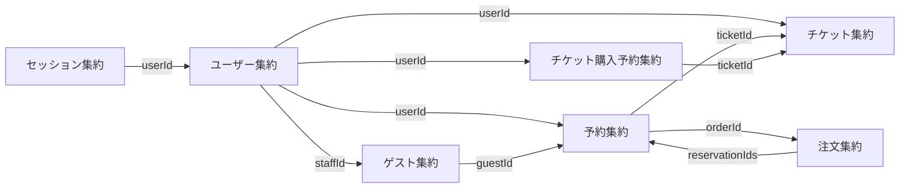
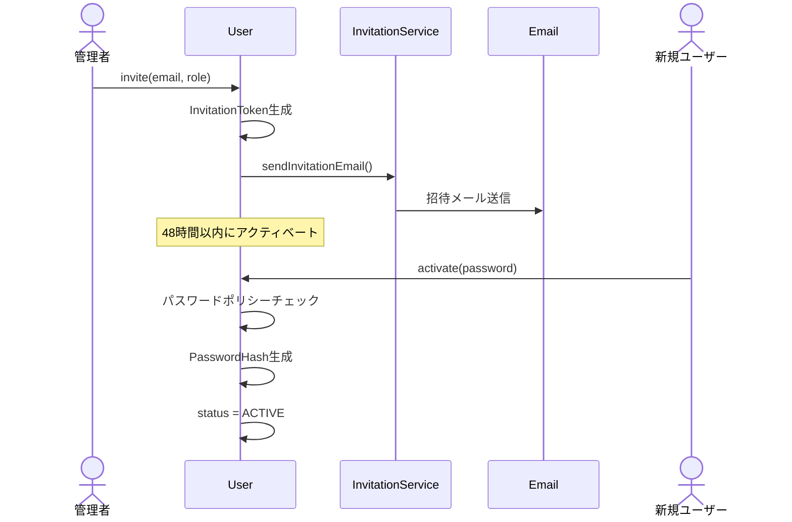
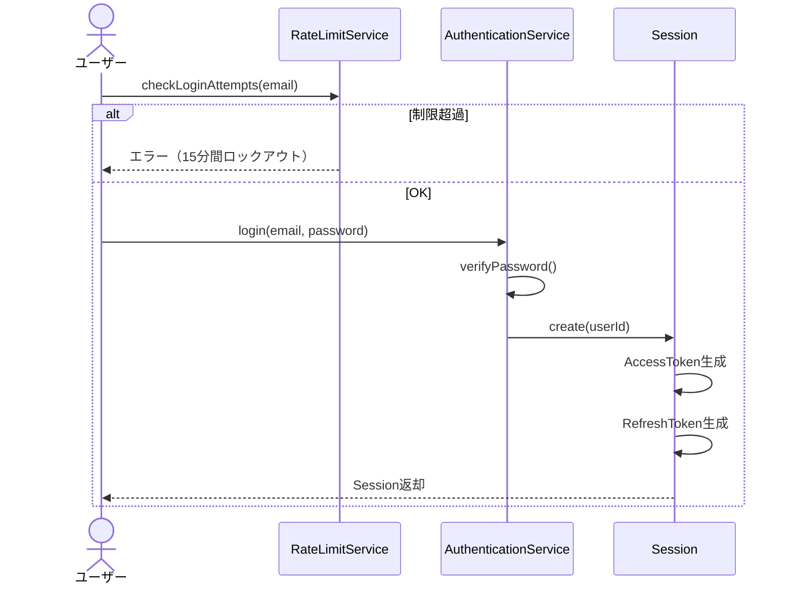
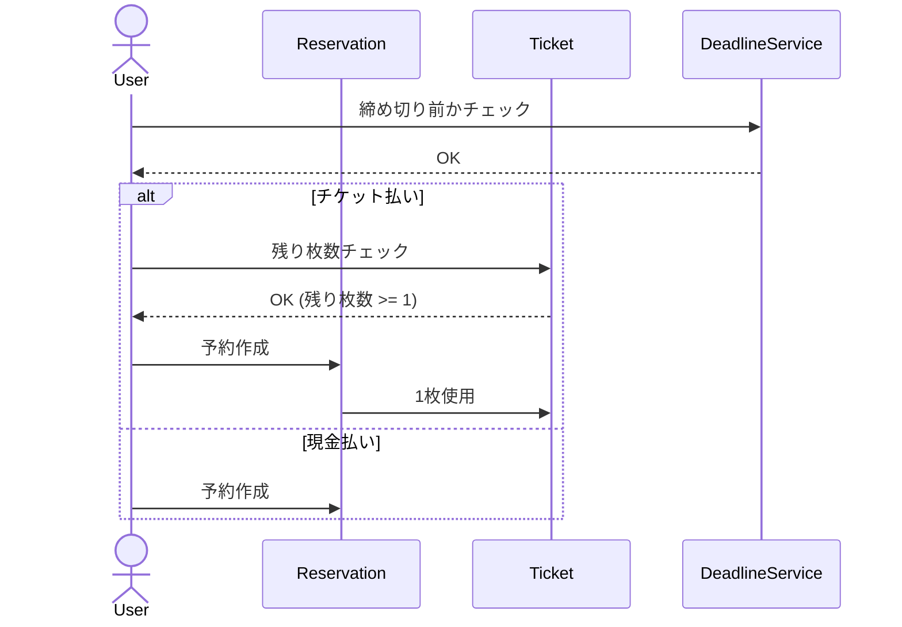
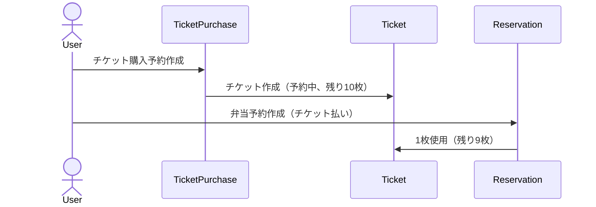
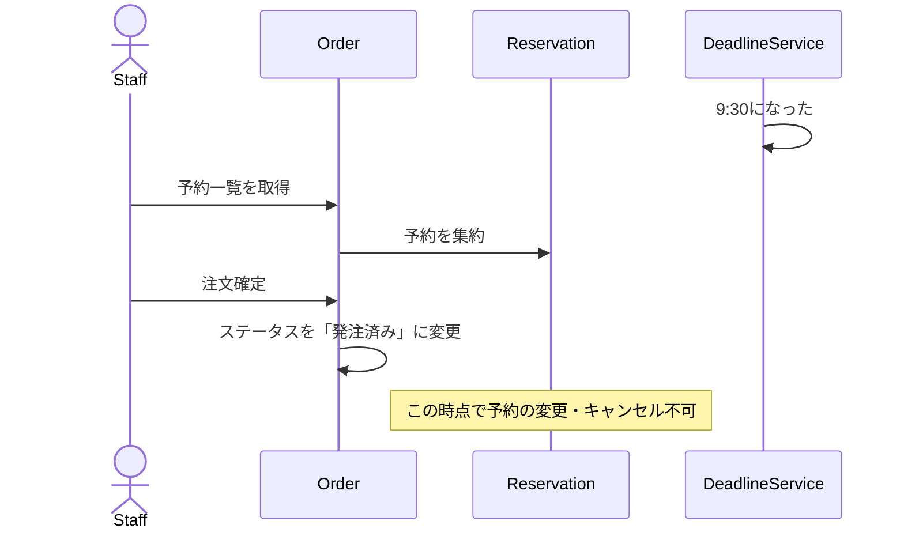

# ドメインモデル

> このドキュメントは、Lunch-Hub システムのドメインモデルを視覚化し、エンティティ、値オブジェクト、集約、およびそれらの関係を定義します。

---

## 境界づけられたコンテキスト (Bounded Contexts)

---

## ドメインモデル全体図

---

## 集約（Aggregate）の定義

DDDでは、関連するエンティティと値オブジェクトを**集約**としてグループ化します。各集約には**集約ルート**があり、外部からはこのルートを通じてのみアクセスします。

### 1. ユーザー集約 (User Aggregate)

→ 詳細は [IAMモジュール設計書](modules/iam.md#1-user集約) を参照

---

### 2. セッション集約 (Session Aggregate)

→ 詳細は [IAMモジュール設計書](modules/iam.md#2-session集約) を参照

---

### 3. 予約集約 (Reservation Aggregate)

→ 詳細は [Reservationモジュール設計書](modules/reservation.md#1-reservation集約) を参照

---

### 4. 注文集約 (Order Aggregate)

→ 詳細は [Orderモジュール設計書](modules/order.md#1-order集約) を参照

---

### 5. チケット集約 (Ticket Aggregate)

→ 詳細は [Ticketモジュール設計書](modules/ticket.md#1-ticket集約) を参照

---

### 6. チケット購入予約集約 (TicketPurchaseReservation Aggregate)

→ 詳細は [Ticketモジュール設計書](modules/ticket.md#2-ticketpurchasereservation集約) を参照

---

### 7. ゲスト集約 (Guest Aggregate)

→ 詳細は [Reservationモジュール設計書](modules/reservation.md#2-guest集約) を参照

---

## 集約間の関係

### 参照の方向

**重要な原則:**
- 集約間の参照は**IDのみ**を使用（オブジェクト参照は避ける）
- 集約の境界を越えた整合性は**結果整合性**で管理
- トランザクションは1つの集約内で完結

---

## エンティティ vs 値オブジェクト

### エンティティ（Identity を持つ）
- **User**: ユーザーID で識別
- **Session**: セッションID で識別
- **Reservation**: 予約ID で識別
- **Order**: 注文ID で識別
- **Ticket**: チケットID で識別
- **TicketPurchaseReservation**: 購入予約ID で識別
- **Guest**: ゲストID で識別

### 値オブジェクト（値で識別）

#### 列挙型
- **Role**: 列挙型（GENERAL_USER, STAFF, ADMINISTRATOR）
- **UserStatus**: 列挙型（INVITED, ACTIVE, DEACTIVATED）
- **PaymentMethod**: 列挙型（CASH, TICKET）
- **ReservationStatus**: 列挙型（CONFIRMED, CANCELLED, FINALIZED）
- **OrderStatus**: 列挙型（PENDING, PLACED）
- **TicketStatus**: 列挙型（PENDING, RECEIVED）

#### ビジネスルールを持つ値オブジェクト

各値オブジェクトの詳細（責務・不変条件・振る舞い）は、所属するモジュール設計書を参照。

| 値オブジェクト | 所属コンテキスト | 詳細リンク |
|---------------|-----------------|-----------|
| DisplayName, EmailAddress, PasswordHash, InvitationToken, PasswordResetToken, AccessToken, RefreshToken | IAM | [IAMモジュール設計書](modules/iam.md#1-user集約) |
| ReservationPeriod | Reservation | [Reservationモジュール設計書](modules/reservation.md#1-reservation集約) |
| DeadlineTime | Order | [Orderモジュール設計書](modules/order.md#1-order集約) |
| TicketCount | Ticket | [Ticketモジュール設計書](modules/ticket.md#1-ticket集約) |
| TicketSetQuantity | Ticket | [Ticketモジュール設計書](modules/ticket.md#2-ticketpurchasereservation集約) |

---

## ドメインサービス

集約に属さないビジネスロジックは**ドメインサービス**として実装します。

| サービス | 所属コンテキスト | 責務 | 詳細リンク |
|----------|-----------------|------|-----------|
| AuthenticationService | IAM | ログイン処理・パスワード検証 | [IAMモジュール設計書](modules/iam.md#ドメインサービス) |
| PasswordHasher | IAM | パスワードのハッシュ化と検証 | [IAMモジュール設計書](modules/iam.md#ドメインサービス) |
| InvitationService | IAM | 招待トークンの生成・検証 | [IAMモジュール設計書](modules/iam.md#ドメインサービス) |
| ReservationDeadlineService | Reservation | 締め切り時刻チェック（当日9:30） | [Reservationモジュール設計書](modules/reservation.md#ドメインサービス) |
| OrderAggregationService | Order | 複数の予約を日単位の注文にまとめる | [Orderモジュール設計書](modules/order.md#ドメインサービス) |
| TicketUsageService | Ticket | チケットの使用・返却 | [Ticketモジュール設計書](modules/ticket.md#ドメインサービス) |

---

## リポジトリインターフェース

各集約に対応するリポジトリインターフェースをドメイン層に定義し、具体的な永続化実装はインフラ層に配置する。

| リポジトリ | 所属コンテキスト | 詳細リンク |
|-----------|-----------------|-----------|
| UserRepository | IAM | [IAMモジュール設計書](modules/iam.md#リポジトリインターフェース) |
| SessionRepository | IAM | [IAMモジュール設計書](modules/iam.md#リポジトリインターフェース) |
| ReservationRepository | Reservation | [Reservationモジュール設計書](modules/reservation.md#リポジトリインターフェース) |
| GuestRepository | Reservation | [Reservationモジュール設計書](modules/reservation.md#リポジトリインターフェース) |
| OrderRepository | Order | [Orderモジュール設計書](modules/order.md#リポジトリインターフェース) |
| TicketRepository | Ticket | [Ticketモジュール設計書](modules/ticket.md#リポジトリインターフェース) |
| TicketPurchaseReservationRepository | Ticket | [Ticketモジュール設計書](modules/ticket.md#リポジトリインターフェース) |

---

## 主要なビジネスフロー

### 1. ユーザー招待・アクティベーションフロー

### 2. ログインフロー

### 3. 弁当予約フロー

### 4. チケット購入 + 弁当予約の同時フロー

### 5. 注文確定フロー

---

## まとめ

このドメインモデルは以下を定義しています：

1. **7つの集約**: User, Session, Reservation, Order, Ticket, TicketPurchaseReservation, Guest
2. **エンティティと値オブジェクト**の区別
3. **集約間の関係**（IDによる参照）
4. **ドメインサービス**（集約に属さないロジック）
5. **リポジトリインターフェース**
6. **主要なビジネスフロー**

