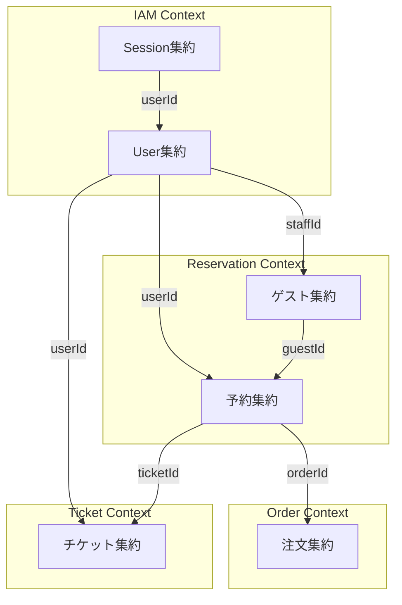
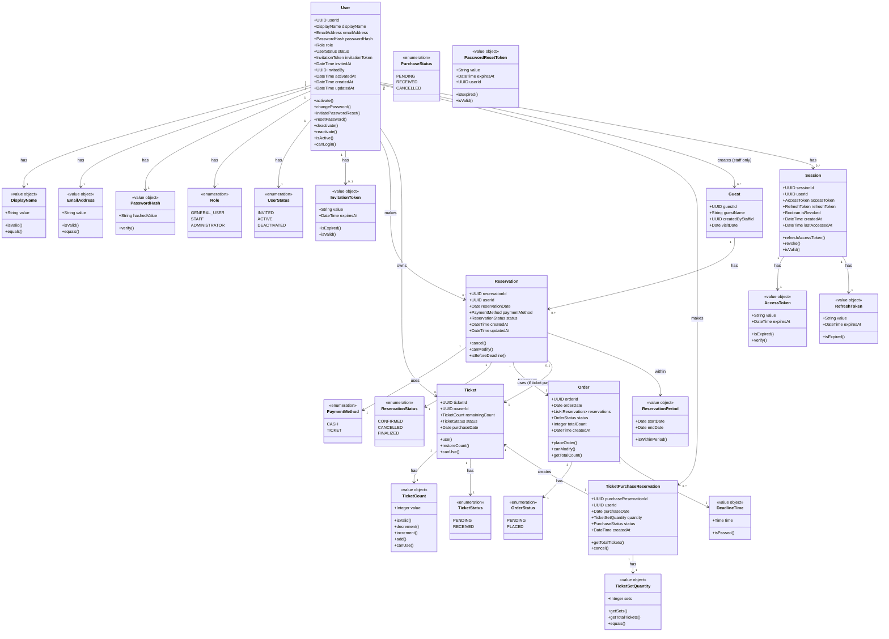
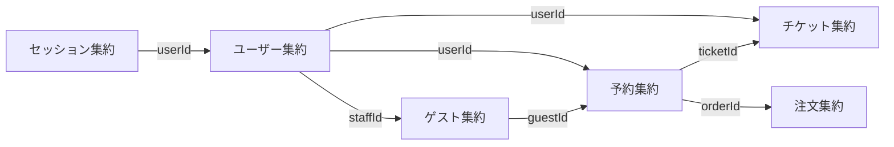
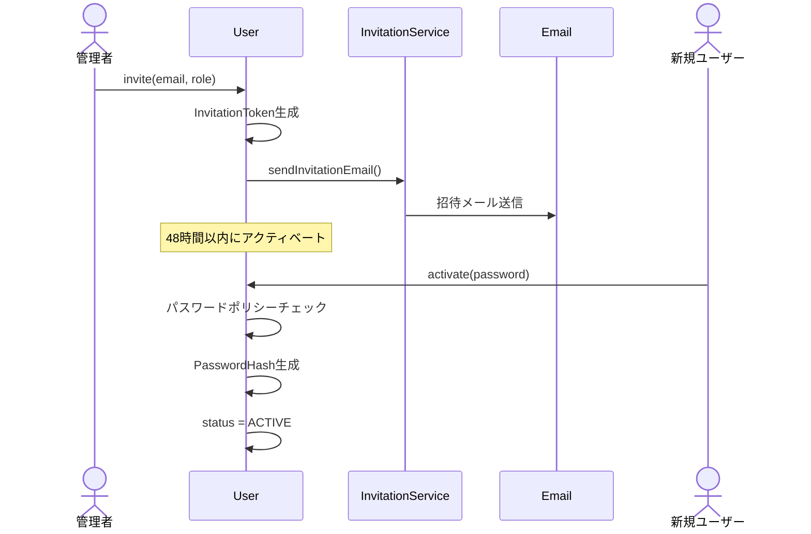
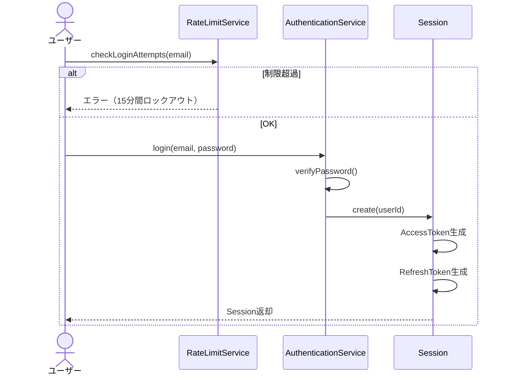
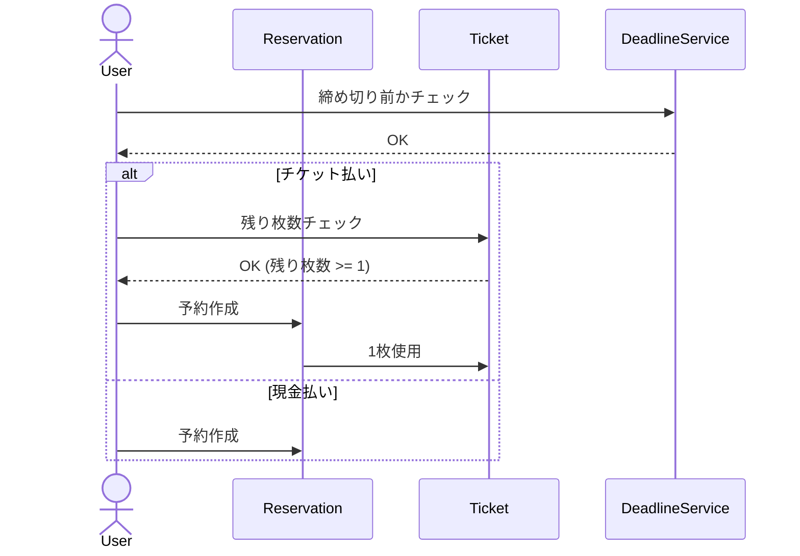
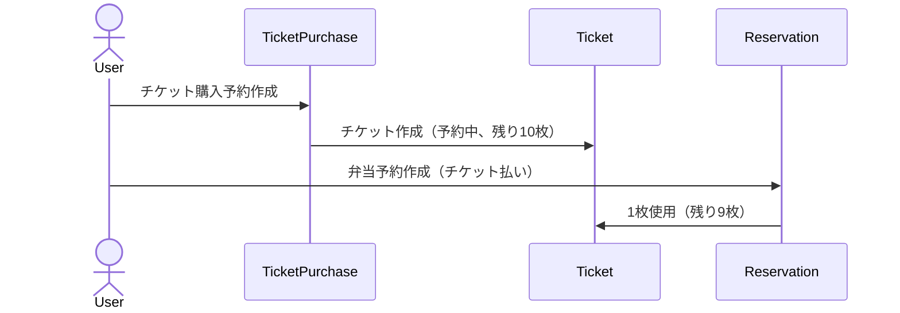
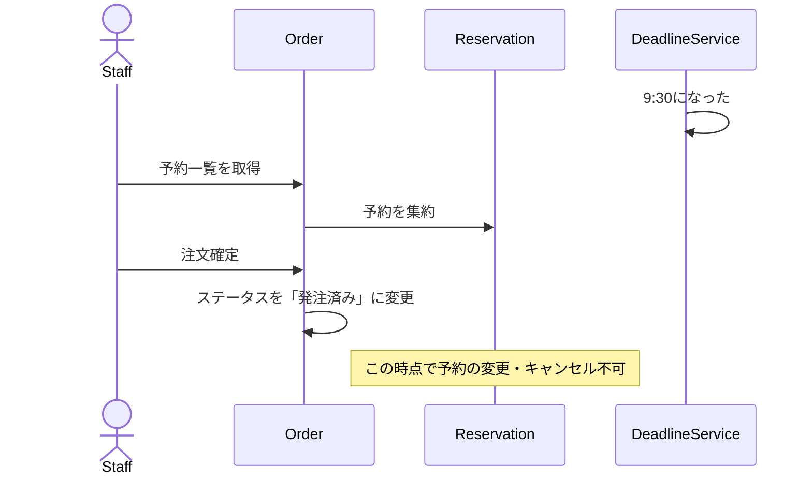

# ドメインモデル

> このドキュメントは、Lunch-Hub システムのドメインモデルを視覚化し、エンティティ、値オブジェクト、集約、およびそれらの関係を定義します。

---

## 境界づけられたコンテキスト (Bounded Contexts)



---

## ドメインモデル全体図



---

## 集約（Aggregate）の定義

DDDでは、関連するエンティティと値オブジェクトを**集約**としてグループ化します。各集約には**集約ルート**があり、外部からはこのルートを通じてのみアクセスします。

### 1. ユーザー集約 (User Aggregate)

**集約ルート:** `User`

**含まれるオブジェクト:**
- User（エンティティ）
- Role（値オブジェクト）
- UserStatus（値オブジェクト）
- InvitationToken（値オブジェクト）

**責務:**
- ユーザーの識別情報と認証情報の管理
- ユーザーのライフサイクル管理(招待 → アクティベーション → アクティブ)
- パスワードの変更とリセット
- 役割の管理
- ロールに基づく権限チェック

**不変条件:**
- メールアドレスは一意
- ロールは1つのみ
- 無効化されたユーザーはログイン不可
- アクティブなユーザーは必ずパスワードハッシュを持つ
- 招待済みユーザーは招待トークンを持つ
- 招待トークンの有効期限は48時間

**ドメインイベント:**
- `UserInvited`: ユーザーが招待された
- `UserActivated`: ユーザーがアクティベートされた
- `PasswordChanged`: パスワードが変更された
- `PasswordResetRequested`: パスワードリセットが要求された
- `PasswordReset`: パスワードがリセットされた
- `UserDeactivated`: ユーザーが無効化された
- `UserReactivated`: ユーザーが再有効化された

---

### 2. セッション集約 (Session Aggregate)

**集約ルート:** `Session`

**含まれるオブジェクト:**
- Session（エンティティ）
- AccessToken（値オブジェクト）
- RefreshToken（値オブジェクト）

**責務:**
- セッションの作成と管理
- トークンの発行と検証
- セッションの無効化

**不変条件:**
- アクセストークンの有効期限は15分
- リフレッシュトークンの有効期限は7日
- 無効化されたセッションは再利用できない

**ドメインイベント:**
- `SessionCreated`: セッションが作成された
- `AccessTokenRefreshed`: アクセストークンが更新された
- `SessionRevoked`: セッションが無効化された

---

### 3. 予約集約 (Reservation Aggregate)

**集約ルート:** `Reservation`

**含まれるオブジェクト:**
- Reservation（エンティティ）
- PaymentMethod（値オブジェクト）
- ReservationStatus（値オブジェクト）
- ReservationPeriod（値オブジェクト）

**責務:**
- 弁当予約の作成・変更・キャンセル
- 締め切り時刻のチェック
- 支払い方法の管理

**不変条件:**
- 予約は1つの日付に紐づく
- 予約は1つの支払い方法を持つ
- 締め切り時刻を過ぎた予約は変更・キャンセル不可
- チケット払いの場合、チケットの残り枚数が1以上必要

---

### 4. 注文集約 (Order Aggregate)

**集約ルート:** `Order`

**含まれるオブジェクト:**
- Order（エンティティ）
- OrderStatus（値オブジェクト）
- DeadlineTime（値オブジェクト）

**責務:**
- 複数の予約を取りまとめる
- お弁当屋さんへの発注管理
- 注文の確定

**不変条件:**
- 注文は1つの日付に紐づく
- 発注済みの注文に含まれる予約は変更・キャンセル不可
- 締め切り時刻後に注文を確定

---

### 5. チケット集約 (Ticket Aggregate)

**集約ルート:** `Ticket`

**含まれるオブジェクト:**
- Ticket（エンティティ）
- TicketPurchaseReservation（エンティティ）
- TicketStatus（値オブジェクト）
- PurchaseStatus（値オブジェクト）

**責務:**
- チケットの購入予約
- チケットの使用・返却
- 残り枚数の管理

**不変条件:**
- チケットの残り枚数は0以上（上限なし）
- チケット購入予約をすると、即座に「予約中」状態のチケットが作成される
- 予約中のチケットでも弁当予約に使用可能
- チケット購入予約をキャンセルした場合、そのチケットで使用した弁当予約も全てキャンセルされる

---

### 6. ゲスト集約 (Guest Aggregate)

**集約ルート:** `Guest`

**含まれるオブジェクト:**
- Guest（エンティティ）

**責務:**
- 社外訪問者の情報管理
- 係による代理予約

**不変条件:**
- ゲストは係のみが作成可能
- ゲストは自分でログインできない

---

## 集約間の関係

### 参照の方向



**重要な原則:**
- 集約間の参照は**IDのみ**を使用（オブジェクト参照は避ける）
- 集約の境界を越えた整合性は**結果整合性**で管理
- トランザクションは1つの集約内で完結

---

## エンティティ vs 値オブジェクト

### エンティティ（Identity を持つ）
- **User**: ユーザーID で識別
- **Session**: セッションID で識別
- **Reservation**: 予約ID で識別
- **Order**: 注文ID で識別
- **Ticket**: チケットID で識別
- **Guest**: ゲストID で識別

### 値オブジェクト（値で識別）

#### 列挙型
- **Role**: 列挙型（GENERAL_USER, STAFF, ADMINISTRATOR）
- **UserStatus**: 列挙型（INVITED, ACTIVE, DEACTIVATED）
- **PaymentMethod**: 列挙型（CASH, TICKET）
- **ReservationStatus**: 列挙型（CONFIRMED, CANCELLED, FINALIZED）
- **OrderStatus**: 列挙型（PENDING, PLACED）
- **TicketStatus**: 列挙型（PENDING, RECEIVED）

#### ビジネスルールを持つ値オブジェクト

**DisplayName（表示名）**
- **責務**: ユーザーの表示名の検証と正規化
- **バリデーション**:
  - 1文字以上50文字以内
  - 空文字・空白のみは不可
  - 使用可能文字: 日本語（ひらがな、カタカナ、漢字）、英数字、スペース、中点（・）、長音（ー）のみ
  - 絵文字、特殊記号、HTMLタグなどは不可
- **振る舞い**:
  - `isValid()`: 文字種と文字数のチェック
  - `equals()`: 等価性チェック
- **セキュリティ**: XSS攻撃やデータ破損を防ぐため、使用可能文字を制限

**EmailAddress（メールアドレス）**
- **責務**: メールアドレスの形式検証と正規化
- **バリデーション**:
  - メール形式（`user@domain.com`）
  - `@` と `.` が必須
  - 空白文字を含まない
- **振る舞い**:
  - `isValid()`: 形式チェック
  - `equals()`: 等価性チェック（小文字に正規化して比較）

**PasswordHash（パスワードハッシュ）**
- **責務**: ハッシュ化されたパスワードの管理と検証
- **振る舞い**:
  - `verify(password)`: パスワード検証
- **注意**: 生のパスワードは保持しない。bcryptでハッシュ化して保存

**InvitationToken（招待トークン）**
- **責務**: ユーザー招待時のトークン管理
- **有効期限**: 48時間
- **振る舞い**:
  - `isExpired()`: 有効期限切れチェック
  - `isValid()`: 有効性チェック

**PasswordResetToken（パスワードリセットトークン）**
- **責務**: パスワードリセット時のトークン管理
- **有効期限**: 1時間
- **振る舞い**:
  - `isExpired()`: 有効期限切れチェック
  - `isValid()`: 有効性チェック

**AccessToken（アクセストークン）**
- **責務**: API認証用JWTトークンの管理
- **有効期限**: 15分
- **振る舞い**:
  - `isExpired()`: 有効期限切れチェック
  - `verify()`: トークン検証

**RefreshToken（リフレッシュトークン）**
- **責務**: アクセストークン更新用トークンの管理
- **有効期限**: 7日
- **振る舞い**:
  - `isExpired()`: 有効期限切れチェック

**TicketCount（チケット枚数）**
- **責務**: チケット残り枚数の管理と不変条件の保証
- **不変条件**: 0以上（上限なし）
- **振る舞い**:
  - `isValid()`: 範囲チェック（0以上）
  - `decrement()`: 1枚減らす（0枚の場合はエラー）
  - `increment()`: 1枚増やす
  - `add(count)`: 指定枚数を追加（チケット購入時）
  - `canUse()`: 使用可能かチェック（残り枚数 > 0）
- **注意**: 不変オブジェクト（変更時は新しいインスタンスを返す）

**TicketSetQuantity（チケットセット数）**
- **責務**: チケット購入時のセット数管理と枚数計算
- **不変条件**:
  - 1セット以上
  - 整数のみ
  - 1セット = 10枚固定
- **振る舞い**:
  - `getSets()`: セット数を取得
  - `getTotalTickets()`: 合計枚数を計算（セット数 × 10）
  - `equals()`: 等価性チェック
- **ビジネスルール**: チケットは10枚セット単位でのみ購入可能
- **例**: 3セット購入 → 30枚のチケットが付与される

**DeadlineTime（締め切り時刻）**
- **責務**: 注文締め切り時刻（9:30）の管理
- **固定値**: 9時30分
- **振る舞い**:
  - `isPassed()`: 現在時刻が締め切りを過ぎているかチェック

**ReservationPeriod（予約可能期間）**
- **責務**: 予約可能期間（現在〜翌月末）の管理
- **範囲**: 現在日〜翌月末
- **振る舞い**:
  - `isWithinPeriod()`: 指定日が期間内かチェック

---

## ドメインサービス

集約に属さないビジネスロジックは**ドメインサービス**として実装します。

### 1. AuthenticationService
**責務:** ログイン処理とパスワード検証

```typescript
class AuthenticationService {
  login(email: Email, password: Password): Session;
  verifyPassword(user: User, password: Password): boolean;
}
```

### 2. InvitationService
**責務:** 招待メールとパスワードリセットメールの送信

```typescript
class InvitationService {
  sendInvitationEmail(user: User, invitationToken: InvitationToken): void;
  sendPasswordResetEmail(user: User, resetToken: PasswordResetToken): void;
}
```

### 3. RateLimitService
**責務:** ログイン試行回数の制限（10回/15分）

```typescript
class RateLimitService {
  checkLoginAttempts(email: Email): boolean;
  recordLoginAttempt(email: Email, success: boolean): void;
}
```

### 4. ReservationDeadlineService
**責務:** 締め切り時刻のチェック

```typescript
class ReservationDeadlineService {
  canModifyReservation(reservation: Reservation): boolean {
    // 当日9:30より前かチェック
  }
}
```

### 5. TicketUsageService
**責務:** チケットの使用・返却ロジック

```typescript
class TicketUsageService {
  useTicket(ticket: Ticket, reservation: Reservation): void {
    // チケットの残り枚数を減らす
  }

  restoreTicketCount(ticket: Ticket, reservation: Reservation): void {
    // チケットの残り枚数を増やす（予約キャンセル時など）
  }
}
```

### 6. OrderAggregationService
**責務:** 予約を注文にまとめる

```typescript
class OrderAggregationService {
  createOrder(reservations: Reservation[], orderDate: Date): Order {
    // 複数の予約から注文を作成
  }
}
```

---

## リポジトリインターフェース

### UserRepository
```typescript
interface UserRepository {
  save(user: User): Promise<void>;
  findById(userId: UserId): Promise<User | null>;
  findByEmail(email: Email): Promise<User | null>;
  findByInvitationToken(token: InvitationToken): Promise<User | null>;
  existsByEmail(email: Email): Promise<boolean>;
}
```

### SessionRepository
```typescript
interface SessionRepository {
  save(session: Session): Promise<void>;
  findById(sessionId: SessionId): Promise<Session | null>;
  findByRefreshToken(refreshToken: RefreshToken): Promise<Session | null>;
  findActiveSessionsByUserId(userId: UserId): Promise<Session[]>;
  revokeAllByUserId(userId: UserId): Promise<void>;
}
```

### PasswordResetTokenRepository
```typescript
interface PasswordResetTokenRepository {
  save(token: PasswordResetToken): Promise<void>;
  findByToken(token: string): Promise<PasswordResetToken | null>;
  deleteByUserId(userId: UserId): Promise<void>;
}
```

---

## 主要なビジネスフロー

### 1. ユーザー招待・アクティベーションフロー



### 2. ログインフロー



### 3. 弁当予約フロー



### 4. チケット購入 + 弁当予約の同時フロー



### 5. 注文確定フロー



---

## まとめ

このドメインモデルは以下を定義しています：

1. **6つの集約**: User, Session, Reservation, Order, Ticket, Guest
2. **エンティティと値オブジェクト**の区別
3. **集約間の関係**（IDによる参照）
4. **ドメインサービス**（集約に属さないロジック）
5. **リポジトリインターフェース**
6. **主要なビジネスフロー**

---

**更新履歴:**
- 2025-11-30: 初版作成
- 2026-02-01: ドキュメント再編成（認証機能ドメインモデルを統合、Session集約追加）
