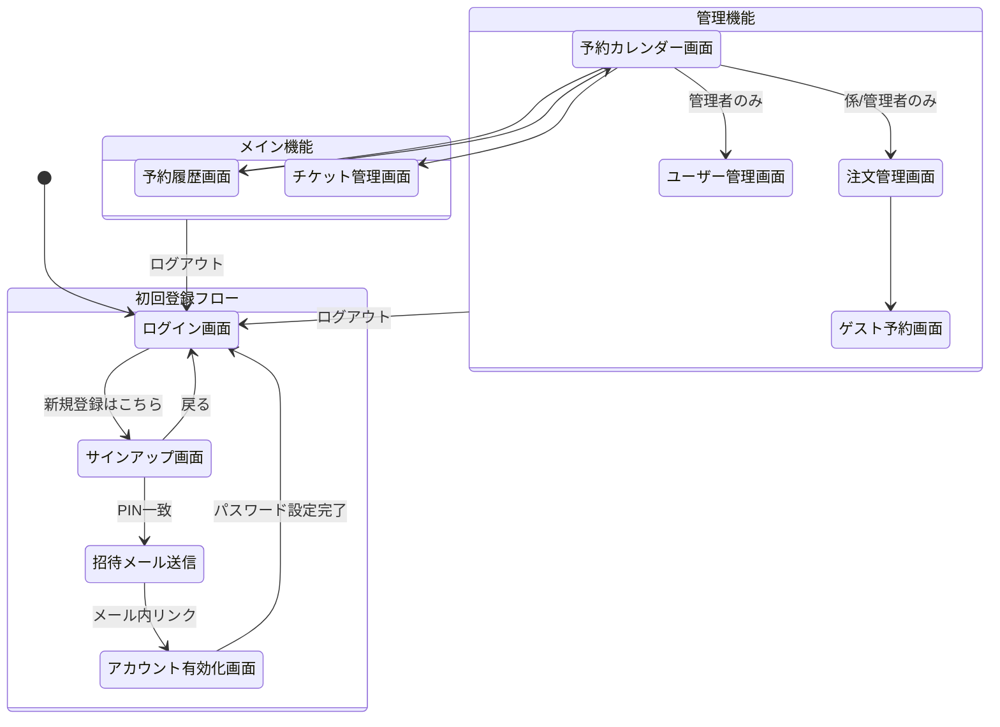

# Lunch Hub UI設計書

## 画面設計

### 画面一覧
| ID     | 画面名               | 説明                                 | 権限                 |
| :----- | :------------------- | :----------------------------------- | :------------------- |
| P-001  | ログイン画面         | メールアドレスとパスワードでログイン | 全員                 |
| P-001b | サインアップ画面     | PINとメールアドレスで登録申請を行う  | 未登録社員           |
| P-002  | アカウント有効化画面 | 招待メールから初回パスワードを設定   | 招待中ユーザー       |
| P-101  | 予約カレンダー画面   | 弁当の予約作成、変更、確認           | 全員                 |
| P-102  | 予約履歴画面         | 過去・未来の予約一覧の確認           | 全員                 |
| P-201  | チケット管理画面     | チケット購入予約、残高確認           | 全員                 |
| P-301  | 注文管理画面         | 日別の注文数集計、確定操作           | STAFF, ADMINISTRATOR |
| P-302  | ゲスト予約画面       | ゲスト用の代理予約作成               | STAFF, ADMINISTRATOR |
| P-401  | ユーザー管理画面     | ユーザー招待、ロール変更、無効化     | ADMINISTRATOR        |

### 画面遷移図

