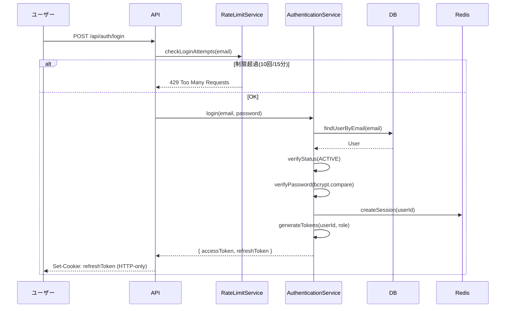

# 認証処理フロー詳細

このドキュメントは、IAMモジュールの認証関連処理の実装フローを詳細に説明します。

## ログイン処理

### 処理フロー



### 処理ステップ

1. **レート制限チェック**: Redisを参照し、短時間での試行回数超過(10回/15分)ならエラー
2. **ユーザー検索**: `email` をキーにDBからユーザーを取得
3. **状態検証**: ユーザーが `ACTIVE` か確認
4. **パスワード検証**: `bcrypt.compare` でハッシュを照合
5. **トークン生成**: `accessToken`(15m) と `refreshToken`(7d) を発行
6. **セッション保存**: Redisにセッション情報を保存
7. **最終ログイン更新**: `lastLoginAt` を現在時刻(JST)で更新

### エラーハンドリング

| エラー           | HTTPステータス | メッセージ                                       |
| ---------------- | -------------- | ------------------------------------------------ |
| レート制限超過   | 429            | Too many login attempts. Please try again later. |
| ユーザー不在     | 401            | Invalid email or password                        |
| パスワード不一致 | 401            | Invalid email or password                        |
| ユーザー無効     | 403            | Account is deactivated                           |
| ユーザー招待中   | 403            | Account is not activated yet                     |

---

## セルフサインアップ処理

### 処理ステップ

1. **入力バリデーション**: `email` と `pin` の形式をチェック
2. **PIN検証**: 入力された `pin` がシステム設定（環境変数）の `COMPANY_PIN` と一致するか確認
   - タイミング攻撃対策として定数時間比較を使用
3. **重複チェック**: 既にその `email` でユーザーが存在しないか確認
4. **ユーザー仮登録**:
   - `role = GENERAL_USER`, `status = INVITED` としてユーザーレコードを作成
   - 招待用トークン（UUID）を生成し、有効期限(48h)と共に保存
5. **メール送信**: 招待用リンクを含むメールを送信

### 実装例

```typescript
// PIN検証（定数時間比較）
const isPinValid = crypto.timingSafeEqual(
  Buffer.from(inputPin),
  Buffer.from(process.env.COMPANY_PIN)
);
```

### エラーハンドリング

| エラー         | HTTPステータス | メッセージ                      |
| -------------- | -------------- | ------------------------------- |
| PIN不一致      | 401            | Invalid PIN                     |
| メール重複     | 409            | Email already exists            |
| メール送信失敗 | 500            | Failed to send invitation email |

---

## アカウント有効化処理

### 処理ステップ

1. **トークン検証**: URLパラメータの `token` をキーにDBで招待中ユーザーを検索。期限切れや存在しない場合はエラー
2. **入力バリデーション**: `password` (ポリシー準拠) と `displayName` の形式をチェック
3. **パスワードハッシュ化**: `bcrypt.hash` でハッシュを生成
4. **ユーザー情報更新**:
   - `passwordHash`, `displayName` を保存
   - `status = ACTIVE` に変更
   - `invitationToken` を無効化
5. **セッション発行**: 自動ログインとしてJWTを発行

### エラーハンドリング

| エラー                 | HTTPステータス | メッセージ                          |
| ---------------------- | -------------- | ----------------------------------- |
| トークン不正           | 404            | Invalid invitation token            |
| トークン期限切れ       | 410            | Invitation token has expired        |
| パスワードポリシー違反 | 400            | Password does not meet requirements |

---

## パスワードリセット処理

### リセット要求フロー

1. **メールアドレス検証**: 入力されたメールアドレスでユーザーを検索
2. **リセットトークン生成**: UUID形式のトークンを生成（有効期限: 1時間）
3. **トークン保存**: DBにリセットトークンを保存
4. **メール送信**: リセット用リンクを含むメールを送信

### リセット実行フロー

1. **トークン検証**: URLパラメータの `token` をキーにDBで検索
2. **パスワードバリデーション**: 新しいパスワードがポリシーに準拠しているか確認
3. **パスワード更新**: `bcrypt.hash` でハッシュ化し、DBに保存
4. **トークン無効化**: 使用済みリセットトークンを削除
5. **全セッション無効化**: セキュリティのため、既存の全セッションを無効化

---

## トークンリフレッシュ処理

### 処理フロー

1. **リフレッシュトークン検証**: HTTP-only Cookieからリフレッシュトークンを取得
2. **セッション検索**: Redisからセッション情報を取得
3. **有効性確認**: セッションが無効化されていないか、期限切れでないか確認
4. **新しいアクセストークン発行**: 新しいアクセストークン(15分)を生成
5. **最終アクセス時刻更新**: セッションの `lastAccessedAt` を更新

---

## セキュリティ実装詳細

### パスワードポリシー

| 項目       | 要件                                        |
| ---------- | ------------------------------------------- |
| 最低文字数 | 8文字                                       |
| 必須文字種 | 英字・数字・記号（`!@#$%^&*`から1文字以上） |
| ハッシュ化 | bcrypt (cost factor: 12)                    |

```typescript
// パスワードバリデーション正規表現
const passwordRegex = /^(?=.*[a-zA-Z])(?=.*\d)(?=.*[!@#$%^&*]).{8,}$/;
```

### レート制限

| 操作                  | 制限      | ロックアウト                |
| --------------------- | --------- | --------------------------- |
| ログイン試行          | 10回/15分 | 15分間全リクエスト拒否(429) |
| PIN確認(サインアップ) | 10回/15分 | 15分間全リクエスト拒否(429) |
| API全般               | 100回/分  | -                           |

### JWT設定

```typescript
// アクセストークン
{
  secret: process.env.JWT_ACCESS_SECRET,
  expiresIn: '15m',
  algorithm: 'HS256'
}

// リフレッシュトークン
{
  secret: process.env.JWT_REFRESH_SECRET,
  expiresIn: '7d',
  algorithm: 'HS256'
}
```

### HTTP-only Cookie設定

```typescript
Set-Cookie: refreshToken=...; HttpOnly; Secure; SameSite=Strict; Max-Age=604800
```

---

## メールテンプレート

### ユーザー招待 / アカウント有効化メール

- **件名**: 【Lunch Hub】アカウント登録のご案内
- **本文**:
```text
Lunch Hub をご利用いただきありがとうございます。
以下のリンクよりパスワードを設定し、アカウントを有効化してください。

https://lunch-hub.example.com/activate?token={{token}}

※リンクの有効期限は送信から48時間です。
※本メールに心当たりがない場合は、破棄してください。
```

### パスワードリセットメール

- **件名**: 【Lunch Hub】パスワード再設定のご案内
- **本文**:
```text
パスワードの再設定リクエストを受け付けました。
以下のリンクより新しいパスワードを設定してください。

https://lunch-hub.example.com/reset-password?token={{token}}

※リンクの有効期限は送信から1時間です。
※再設定を行わない場合、現在のパスワードが引き続き有効です。
```

