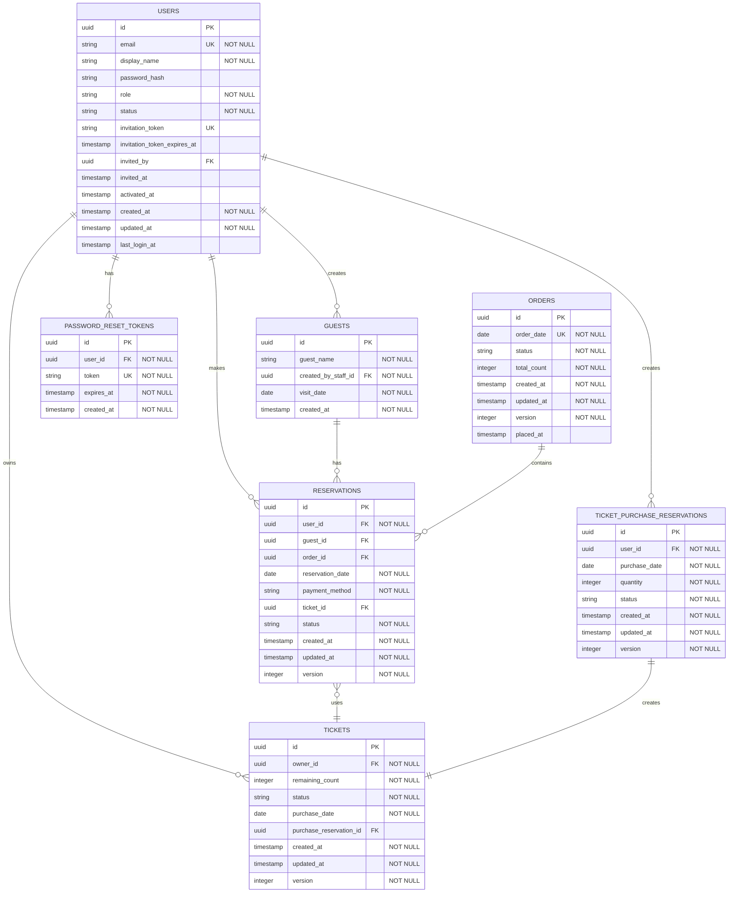

# Lunch Hub データベース設計

## 概要

このドキュメントでは、Lunch HubのPostgreSQLスキーマとRedisデータ構造を定義します。

---

## エンティティ関係図 (ERD)



---

## PostgreSQL スキーマ

### users テーブル

```sql
CREATE TABLE users (
  id UUID PRIMARY KEY DEFAULT gen_random_uuid(),
  email VARCHAR(255) UNIQUE NOT NULL,
  display_name VARCHAR(255) NOT NULL,
  password_hash VARCHAR(255),
  role VARCHAR(50) NOT NULL,
  status VARCHAR(50) NOT NULL,

  -- 招待情報
  invitation_token VARCHAR(255) UNIQUE,
  invitation_token_expires_at TIMESTAMP,
  invited_by UUID REFERENCES users(id),
  invited_at TIMESTAMP,
  activated_at TIMESTAMP,

  -- タイムスタンプ
  created_at TIMESTAMP NOT NULL DEFAULT NOW(),
  updated_at TIMESTAMP NOT NULL DEFAULT NOW(),
  last_login_at TIMESTAMP,

  CONSTRAINT chk_users_status CHECK (status IN ('INVITED', 'ACTIVE', 'DEACTIVATED')),
  CONSTRAINT chk_users_role CHECK (role IN ('GENERAL_USER', 'STAFF', 'ADMINISTRATOR'))
);

-- インデックス
CREATE INDEX idx_users_email ON users(email);
CREATE INDEX idx_users_status ON users(status);
CREATE INDEX idx_users_invitation_token ON users(invitation_token);
```

**カラム説明:**

| カラム | 型 | 説明 |
|--------|-----|------|
| id | UUID | 主キー |
| email | VARCHAR(255) | メールアドレス（一意） |
| display_name | VARCHAR(255) | 表示名 |
| password_hash | VARCHAR(255) | bcryptハッシュ化パスワード |
| role | VARCHAR(50) | 役割（GENERAL_USER, STAFF, ADMINISTRATOR） |
| status | VARCHAR(50) | 状態（INVITED, ACTIVE, DEACTIVATED） |
| invitation_token | VARCHAR(255) | 招待トークン |
| invitation_token_expires_at | TIMESTAMP | 招待トークン有効期限 |
| invited_by | UUID | 招待した管理者のID |
| invited_at | TIMESTAMP | 招待日時 |
| activated_at | TIMESTAMP | アクティベーション日時 |
| created_at | TIMESTAMP | 作成日時 |
| updated_at | TIMESTAMP | 更新日時 |
| last_login_at | TIMESTAMP | 最終ログイン日時 |

---

### reservations テーブル

```sql
CREATE TABLE reservations (
  id UUID PRIMARY KEY DEFAULT gen_random_uuid(),
  user_id UUID NOT NULL REFERENCES users(id),
  guest_id UUID REFERENCES guests(id),
  reservation_date DATE NOT NULL,
  payment_method VARCHAR(50) NOT NULL,
  status VARCHAR(50) NOT NULL,
  ticket_id UUID REFERENCES tickets(id),
  order_id UUID REFERENCES orders(id),

  created_at TIMESTAMP NOT NULL DEFAULT NOW(),
  updated_at TIMESTAMP NOT NULL DEFAULT NOW(),
  version INTEGER NOT NULL DEFAULT 1,

  CONSTRAINT chk_reservations_payment_method CHECK (payment_method IN ('CASH', 'TICKET')),
  CONSTRAINT chk_reservations_status CHECK (status IN ('CONFIRMED', 'CANCELLED', 'FINALIZED')),
  CONSTRAINT chk_reservations_ticket_payment CHECK (
    (payment_method = 'TICKET' AND ticket_id IS NOT NULL) OR
    (payment_method = 'CASH' AND ticket_id IS NULL)
  )
);

-- インデックス
CREATE INDEX idx_reservations_user_id ON reservations(user_id);
CREATE INDEX idx_reservations_date ON reservations(reservation_date);
CREATE INDEX idx_reservations_status ON reservations(status);
CREATE INDEX idx_reservations_order_id ON reservations(order_id);
```

**カラム説明:**

| カラム | 型 | 説明 |
|--------|-----|------|
| id | UUID | 主キー |
| user_id | UUID | 予約者のユーザーID |
| guest_id | UUID | ゲストID（ゲスト予約の場合） |
| reservation_date | DATE | 予約日 |
| payment_method | VARCHAR(50) | 支払い方法（CASH, TICKET） |
| status | VARCHAR(50) | 状態（CONFIRMED, CANCELLED, FINALIZED） |
| ticket_id | UUID | 使用するチケットID（チケット払いの場合） |
| order_id | UUID | 紐づく注文ID |
| version | INTEGER | 楽観的ロック用バージョン |

---

### orders テーブル

```sql
CREATE TABLE orders (
  id UUID PRIMARY KEY DEFAULT gen_random_uuid(),
  order_date DATE NOT NULL UNIQUE,
  status VARCHAR(50) NOT NULL,
  total_count INTEGER NOT NULL DEFAULT 0,

  created_at TIMESTAMP NOT NULL DEFAULT NOW(),
  updated_at TIMESTAMP NOT NULL DEFAULT NOW(),
  version INTEGER NOT NULL DEFAULT 1,
  placed_at TIMESTAMP,

  CONSTRAINT chk_orders_status CHECK (status IN ('PENDING', 'PLACED'))
);

-- インデックス
CREATE INDEX idx_orders_date ON orders(order_date);
CREATE INDEX idx_orders_status ON orders(status);
```

**カラム説明:**

| カラム | 型 | 説明 |
|--------|-----|------|
| id | UUID | 主キー |
| order_date | DATE | 注文日（一意） |
| status | VARCHAR(50) | 状態（PENDING, PLACED） |
| total_count | INTEGER | 注文総数 |
| placed_at | TIMESTAMP | 発注日時 |
| version | INTEGER | 楽観的ロック用バージョン |

---

### tickets テーブル

```sql
CREATE TABLE tickets (
  id UUID PRIMARY KEY DEFAULT gen_random_uuid(),
  owner_id UUID NOT NULL REFERENCES users(id),
  remaining_count INTEGER NOT NULL DEFAULT 0,
  status VARCHAR(50) NOT NULL,
  purchase_date DATE NOT NULL,
  purchase_reservation_id UUID REFERENCES ticket_purchase_reservations(id),

  created_at TIMESTAMP NOT NULL DEFAULT NOW(),
  updated_at TIMESTAMP NOT NULL DEFAULT NOW(),
  version INTEGER NOT NULL DEFAULT 1,

  CONSTRAINT chk_tickets_status CHECK (status IN ('PENDING', 'RECEIVED')),
  CONSTRAINT chk_tickets_remaining_count CHECK (remaining_count >= 0)
);

-- インデックス
CREATE INDEX idx_tickets_owner_id ON tickets(owner_id);
CREATE INDEX idx_tickets_status ON tickets(status);
```

**カラム説明:**

| カラム | 型 | 説明 |
|--------|-----|------|
| id | UUID | 主キー |
| owner_id | UUID | 所有者のユーザーID |
| remaining_count | INTEGER | 残り枚数（0-10） |
| status | VARCHAR(50) | 状態（PENDING, RECEIVED） |
| purchase_date | DATE | 購入日 |
| purchase_reservation_id | UUID | 購入予約ID |
| version | INTEGER | 楽観的ロック用バージョン |

---

### ticket_purchase_reservations テーブル

```sql
CREATE TABLE ticket_purchase_reservations (
  id UUID PRIMARY KEY DEFAULT gen_random_uuid(),
  user_id UUID NOT NULL REFERENCES users(id),
  purchase_date DATE NOT NULL,
  quantity INTEGER NOT NULL DEFAULT 1,
  status VARCHAR(50) NOT NULL,

  created_at TIMESTAMP NOT NULL DEFAULT NOW(),
  updated_at TIMESTAMP NOT NULL DEFAULT NOW(),
  version INTEGER NOT NULL DEFAULT 1,

  CONSTRAINT chk_ticket_purchases_status CHECK (status IN ('PENDING', 'RECEIVED', 'CANCELLED')),
  CONSTRAINT chk_ticket_purchases_quantity CHECK (quantity > 0)
);

-- インデックス
CREATE INDEX idx_ticket_purchases_user_id ON ticket_purchase_reservations(user_id);
CREATE INDEX idx_ticket_purchases_date ON ticket_purchase_reservations(purchase_date);
```

**カラム説明:**

| カラム | 型 | 説明 |
|--------|-----|------|
| id | UUID | 主キー |
| user_id | UUID | 購入者のユーザーID |
| purchase_date | DATE | 購入予約日 |
| quantity | INTEGER | セット数（1セット=10枚） |
| status | VARCHAR(50) | 状態（PENDING, RECEIVED, CANCELLED） |
| version | INTEGER | 楽観的ロック用バージョン |

---

### guests テーブル

```sql
CREATE TABLE guests (
  id UUID PRIMARY KEY DEFAULT gen_random_uuid(),
  guest_name VARCHAR(255) NOT NULL,
  created_by_staff_id UUID NOT NULL REFERENCES users(id),
  visit_date DATE NOT NULL,

  created_at TIMESTAMP NOT NULL DEFAULT NOW()
);

-- インデックス
CREATE INDEX idx_guests_visit_date ON guests(visit_date);
CREATE INDEX idx_guests_staff_id ON guests(created_by_staff_id);
```

**カラム説明:**

| カラム | 型 | 説明 |
|--------|-----|------|
| id | UUID | 主キー |
| guest_name | VARCHAR(255) | ゲスト名 |
| created_by_staff_id | UUID | 作成した係のユーザーID |
| visit_date | DATE | 訪問日 |

---

### password_reset_tokens テーブル

```sql
CREATE TABLE password_reset_tokens (
  id UUID PRIMARY KEY DEFAULT gen_random_uuid(),
  user_id UUID NOT NULL REFERENCES users(id) ON DELETE CASCADE,
  token VARCHAR(255) UNIQUE NOT NULL,
  expires_at TIMESTAMP NOT NULL,
  created_at TIMESTAMP NOT NULL DEFAULT NOW()
);

-- インデックス
CREATE INDEX idx_password_reset_tokens_token ON password_reset_tokens(token);
CREATE INDEX idx_password_reset_tokens_user_id ON password_reset_tokens(user_id);
```

**カラム説明:**

| カラム | 型 | 説明 |
|--------|-----|------|
| id | UUID | 主キー |
| user_id | UUID | ユーザーID |
| token | VARCHAR(255) | リセットトークン（一意） |
| expires_at | TIMESTAMP | 有効期限（1時間） |

---

## Redis データ構造

### セッション

```
Key: session:{sessionId}
Value: {
  "userId": "uuid",
  "refreshToken": "token-string",
  "createdAt": "timestamp",
  "lastAccessedAt": "timestamp"
}
TTL: 7 days (604800 seconds)
```

### リフレッシュトークンマッピング

```
Key: refreshToken:{token}
Value: sessionId
TTL: 7 days
```

### ユーザーのアクティブセッション

```
Key: user:{userId}:sessions
Type: Set
Value: Set<sessionId>
TTL: 7 days
```

### レート制限（ログイン試行）

```
Key: login:attempts:{email}
Type: String (counter)
Value: count (integer)
TTL: 15 minutes (900 seconds)
```

### レート制限（PIN確認）

```
Key: signup:attempts:{email}
Type: String (counter)
Value: count (integer)
TTL: 15 minutes (900 seconds)
```

### キャッシュ（将来的に）

```
Key: cache:user:{userId}
Value: User JSON
TTL: 1 hour (3600 seconds)
```

---

## 同時実行制御

### 楽観的ロック

集約（User, Ticket, Reservation, Order）には `version` カラムを持たせ、TypeORMの `@VersionColumn` を利用した楽観的ロックを行います。

```typescript
@Entity()
class Ticket {
  @VersionColumn()
  version: number;
}
```

更新時にバージョンが一致しない場合は `OptimisticLockVersionMismatchError` が発生します。

---

## タイムゾーン

- **アプリケーション**: Asia/Tokyo (JST) 固定
- **DB接続**: `TZ=Asia/Tokyo` を環境変数で設定
- **締切時刻**: `09:30:00` は JST として扱う

---

## 関連ドキュメント

- [アーキテクチャ設計](./02-design/architecture.md)
- [API設計](./03-api-design.md)
- [ドメインモデル](./02-design/domain-model.md)

---

**更新履歴:**
- 2026-02-01: 初版作成（architecture.md、detailed-design.mdから統合）
