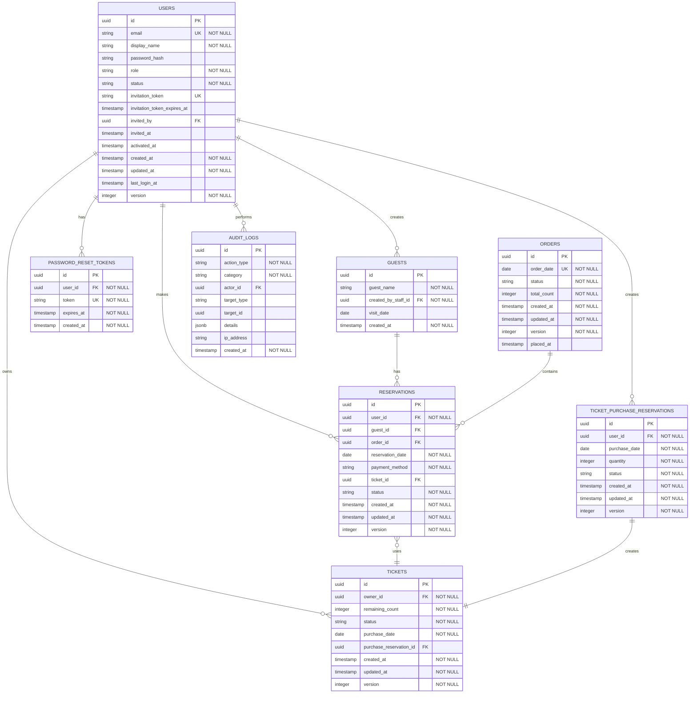

# Lunch Hub データベース設計

## 概要

このドキュメントでは、Lunch HubのPostgreSQLテーブル設計とRedisデータ構造を定義します。
具体的なDDLやマイグレーションはTypeORMで管理するため、ここではテーブルの目的・カラムの意味・ビジネスルールに基づく制約を記述します。

---

## エンティティ関係図 (ERD)



---

## テーブル定義

### users テーブル

**目的**: ユーザーの識別情報・認証情報・ライフサイクル状態を管理する。

| カラム | 型 | 説明 |
|--------|-----|------|
| id | UUID | 主キー |
| email | VARCHAR(255) | メールアドレス（一意） |
| display_name | VARCHAR(50) | 表示名（1-50文字） |
| password_hash | VARCHAR(255) | bcryptハッシュ化パスワード（招待中はNULL） |
| role | VARCHAR(50) | 役割（GENERAL_USER, STAFF, ADMINISTRATOR） |
| status | VARCHAR(50) | 状態（INVITED, ACTIVE, DEACTIVATED） |
| invitation_token | VARCHAR(255) | 招待トークン（一意、有効期限48時間） |
| invitation_token_expires_at | TIMESTAMP | 招待トークン有効期限 |
| invited_by | UUID | 招待した管理者のID（FK: users） |
| invited_at | TIMESTAMP | 招待日時 |
| activated_at | TIMESTAMP | アクティベーション日時 |
| created_at | TIMESTAMP | 作成日時 |
| updated_at | TIMESTAMP | 更新日時 |
| last_login_at | TIMESTAMP | 最終ログイン日時 |
| version | INTEGER | 楽観的ロック用バージョン |

**制約・ルール:**
- email は一意
- role は GENERAL_USER / STAFF / ADMINISTRATOR のいずれか
- status は INVITED / ACTIVE / DEACTIVATED のいずれか
- email, status, invitation_token にインデックスを設定

---

### reservations テーブル

**目的**: ユーザーの弁当予約を管理する。ゲスト予約の場合は係が代理で作成する。

| カラム | 型 | 説明 |
|--------|-----|------|
| id | UUID | 主キー |
| user_id | UUID | 予約者のユーザーID（FK: users）。ゲスト予約の場合は作成した係のID |
| guest_id | UUID | ゲストID（FK: guests）。ゲスト予約の場合のみ設定 |
| reservation_date | DATE | 予約日 |
| payment_method | VARCHAR(50) | 支払い方法（CASH, TICKET） |
| status | VARCHAR(50) | 状態（CONFIRMED, CANCELLED, FINALIZED） |
| ticket_id | UUID | 使用するチケットID（FK: tickets、チケット払いの場合のみ） |
| order_id | UUID | 紐づく注文ID（FK: orders） |
| created_at | TIMESTAMP | 作成日時 |
| updated_at | TIMESTAMP | 更新日時 |
| version | INTEGER | 楽観的ロック用バージョン |

**制約・ルール:**
- 同一ユーザー・同一日に有効な予約は1件のみ（status が CANCELLED 以外の場合、user_id + reservation_date で一意）
- チケット払いの場合は ticket_id 必須、現金払いの場合は ticket_id は NULL
- payment_method は CASH / TICKET のいずれか
- status は CONFIRMED / CANCELLED / FINALIZED のいずれか
- ゲスト予約の識別: guest_id が設定されている場合はゲスト予約。user_id には作成した係のIDが入る
- user_id, reservation_date, status, order_id にインデックスを設定

---

### orders テーブル

**目的**: 日単位の注文を管理する。係がお弁当屋さんに手動発注した記録。

| カラム | 型 | 説明 |
|--------|-----|------|
| id | UUID | 主キー |
| order_date | DATE | 注文日（一意、1日1件） |
| status | VARCHAR(50) | 状態（PENDING, PLACED） |
| total_count | INTEGER | 注文総数 |
| placed_at | TIMESTAMP | 発注日時（係が手動発注した時刻） |
| created_at | TIMESTAMP | 作成日時 |
| updated_at | TIMESTAMP | 更新日時 |
| version | INTEGER | 楽観的ロック用バージョン |

**制約・ルール:**
- order_date は一意（1日に1つの注文のみ）
- status は PENDING / PLACED のいずれか
- order_date, status にインデックスを設定

---

### tickets テーブル

**目的**: ユーザーが所有するチケット（10枚綴り食事券）の残高を管理する。

| カラム | 型 | 説明 |
|--------|-----|------|
| id | UUID | 主キー |
| owner_id | UUID | 所有者のユーザーID（FK: users） |
| remaining_count | INTEGER | 残り枚数（0以上、複数セット購入時は10を超える） |
| status | VARCHAR(50) | 状態（PENDING: 購入予約中, RECEIVED: 受取済み） |
| purchase_date | DATE | 購入日 |
| purchase_reservation_id | UUID | 購入予約ID（FK: ticket_purchase_reservations） |
| created_at | TIMESTAMP | 作成日時 |
| updated_at | TIMESTAMP | 更新日時 |
| version | INTEGER | 楽観的ロック用バージョン |

**制約・ルール:**
- remaining_count は 0 以上（上限なし）
- status は PENDING / RECEIVED のいずれか
- owner_id, status にインデックスを設定

---

### ticket_purchase_reservations テーブル

**目的**: チケットの購入予約を管理する。お弁当屋さんへの購入意思を記録する。

| カラム | 型 | 説明 |
|--------|-----|------|
| id | UUID | 主キー |
| user_id | UUID | 購入者のユーザーID（FK: users） |
| purchase_date | DATE | 購入予約日 |
| quantity | INTEGER | セット数（1セット=10枚、1以上） |
| status | VARCHAR(50) | 状態（PENDING, RECEIVED, CANCELLED） |
| created_at | TIMESTAMP | 作成日時 |
| updated_at | TIMESTAMP | 更新日時 |
| version | INTEGER | 楽観的ロック用バージョン |

**制約・ルール:**
- quantity は 1 以上
- status は PENDING / RECEIVED / CANCELLED のいずれか
- user_id, purchase_date にインデックスを設定

---

### guests テーブル

**目的**: 社外訪問者（ゲスト）の情報を管理する。係が代理で弁当予約を作成するために使用。

| カラム | 型 | 説明 |
|--------|-----|------|
| id | UUID | 主キー |
| guest_name | VARCHAR(255) | ゲスト名 |
| created_by_staff_id | UUID | 作成した係のユーザーID（FK: users） |
| visit_date | DATE | 訪問日（ゲスト予約作成時に予約日から自動設定） |
| created_at | TIMESTAMP | 作成日時 |

**制約・ルール:**
- visit_date はゲスト予約作成時に reservation_date から自動設定される（ゲスト作成時点では NULL 可）
- visit_date, created_by_staff_id にインデックスを設定

---

### password_reset_tokens テーブル

**目的**: パスワードリセット用の一時トークンを管理する。使用後またはユーザー削除時に自動削除。

| カラム | 型 | 説明 |
|--------|-----|------|
| id | UUID | 主キー |
| user_id | UUID | ユーザーID（FK: users、CASCADE DELETE） |
| token | VARCHAR(255) | リセットトークン（一意） |
| expires_at | TIMESTAMP | 有効期限（発行から1時間） |
| created_at | TIMESTAMP | 作成日時 |

**制約・ルール:**
- token は一意
- ユーザー削除時にカスケード削除
- token, user_id にインデックスを設定

---

### audit_logs テーブル

**目的**: セキュリティ監査とシステム監視のための操作ログを記録する。

| カラム | 型 | 説明 |
|--------|-----|------|
| id | UUID | 主キー |
| action_type | VARCHAR(100) | 操作種別（LOGIN_SUCCESS, LOGIN_FAILURE, USER_INVITED, RESERVATION_CREATED 等） |
| category | VARCHAR(50) | カテゴリ（AUTH, DATA_CHANGE, SYSTEM_ERROR） |
| actor_id | UUID | 操作者のユーザーID（FK: users、未認証操作の場合はNULL） |
| target_type | VARCHAR(100) | 対象エンティティの種別（User, Reservation, Ticket 等） |
| target_id | UUID | 対象エンティティのID |
| details | JSONB | 操作の詳細情報 |
| ip_address | VARCHAR(45) | 操作元IPアドレス |
| created_at | TIMESTAMP | 記録日時 |

**制約・ルール:**
- category は AUTH / DATA_CHANGE / SYSTEM_ERROR のいずれか
- **保持期間**（要件に基づく）:
  - AUTH（認証操作: ログイン成功/失敗、招待、アクティベーション、パスワード変更）: 30日
  - DATA_CHANGE（データ変更: 予約作成、チケット購入）: 7日
  - SYSTEM_ERROR（システムエラー）: 30日
- 保持期間を超えたレコードは定期バッチで削除
- action_type, category, actor_id, created_at にインデックスを設定

---

## Redis データ構造

### セッション

```
Key: session:{sessionId}
Value: {
  "userId": "uuid",
  "refreshToken": "token-string",
  "createdAt": "timestamp",
  "lastAccessedAt": "timestamp"
}
TTL: 7 days (604800 seconds)
```

### リフレッシュトークンマッピング

```
Key: refreshToken:{token}
Value: sessionId
TTL: 7 days
```

### ユーザーのアクティブセッション

```
Key: user:{userId}:sessions
Type: Set
Value: Set<sessionId>
TTL: 7 days
```

### レート制限（ログイン試行）

```
Key: login:attempts:{email}
Type: String (counter)
Value: count (integer)
TTL: 15 minutes (900 seconds)
```

### レート制限（PIN確認）

```
Key: signup:attempts:{email}
Type: String (counter)
Value: count (integer)
TTL: 15 minutes (900 seconds)
```

---

## 同時実行制御

### 楽観的ロック

集約（User, Ticket, Reservation, Order, TicketPurchaseReservation）には `version` カラムを持たせ、楽観的ロックを行う。更新時にバージョンが一致しない場合はエラーとなり、競合を検出する。

---

## タイムゾーン

- **アプリケーション**: Asia/Tokyo (JST) 固定
- **DB接続**: `TZ=Asia/Tokyo` を環境変数で設定
- **締切時刻**: `09:30:00` は JST として扱う

---

## 関連ドキュメント

- [アーキテクチャ設計](./02-design/architecture.md)
- [API設計](./03-api-design.md)
- [ドメインモデル](./02-design/domain-model.md)
