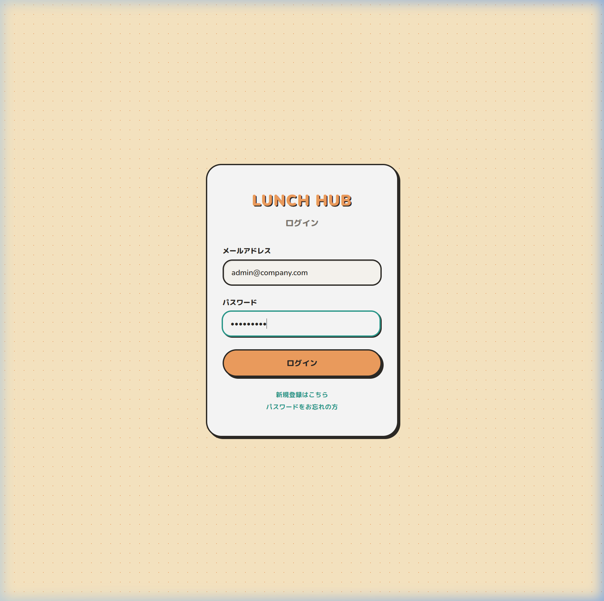
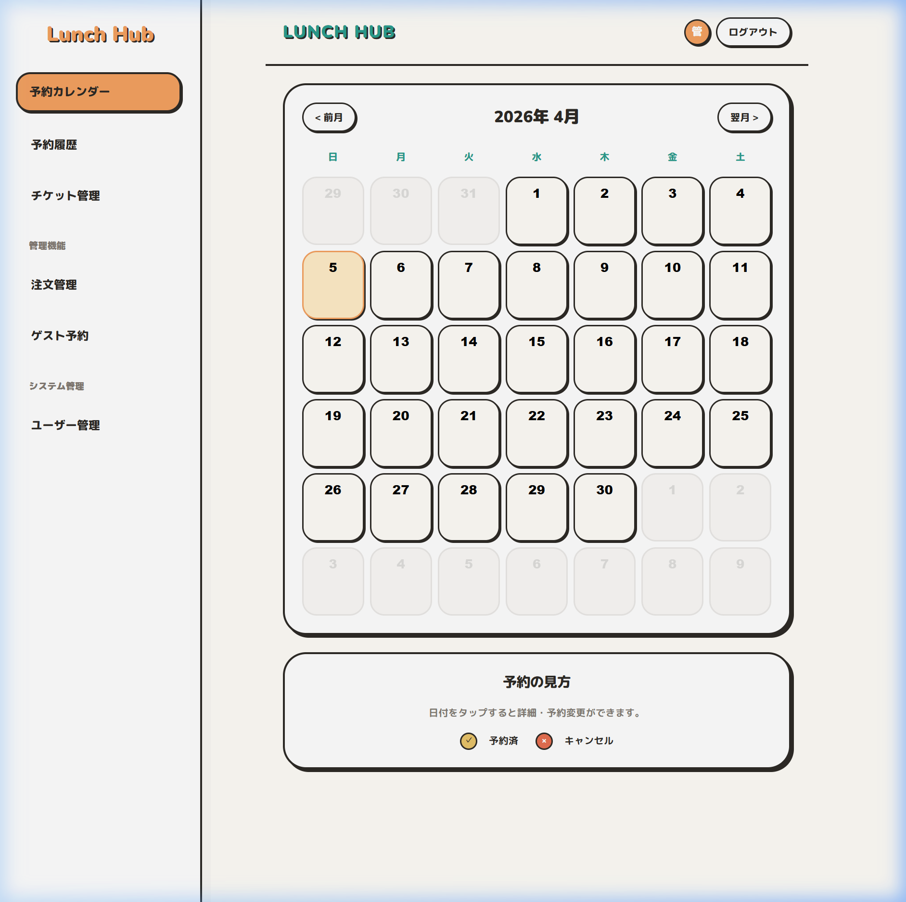
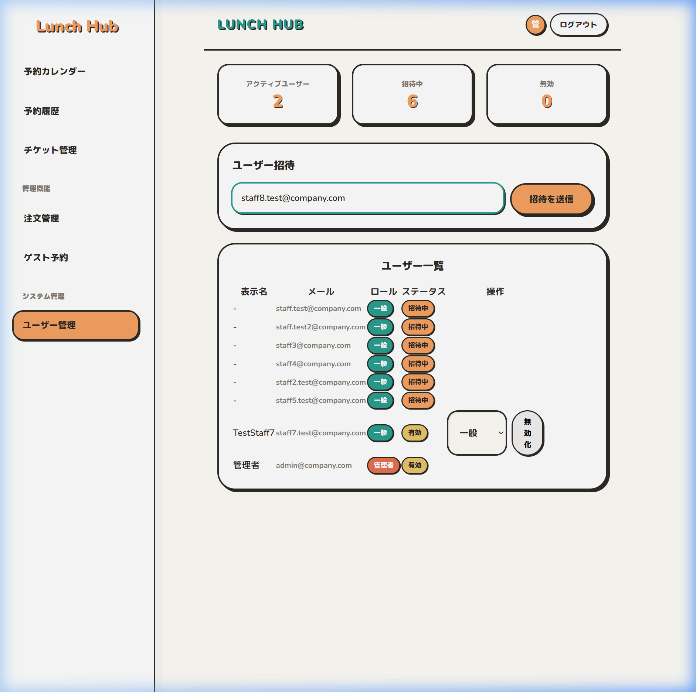
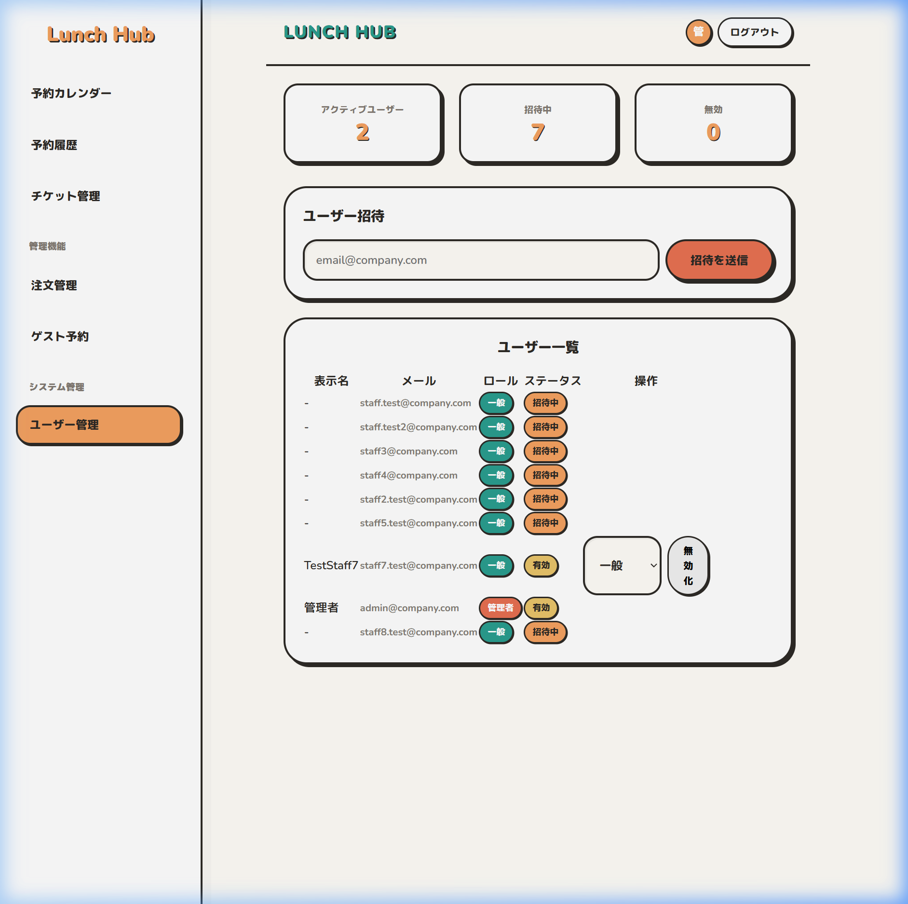
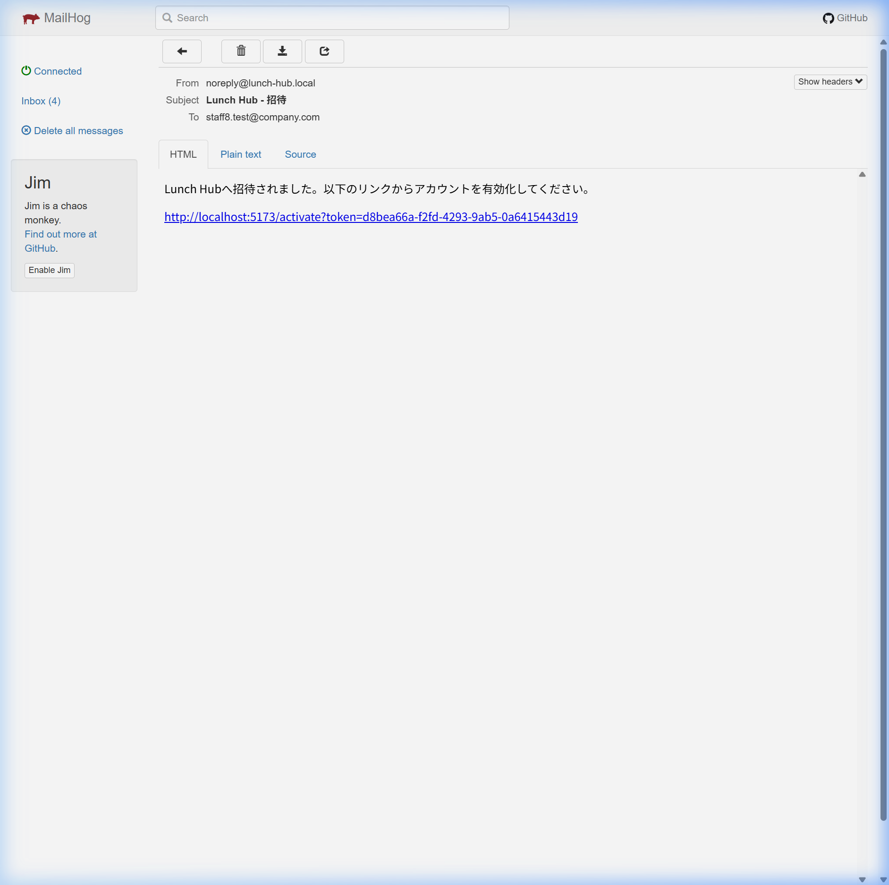
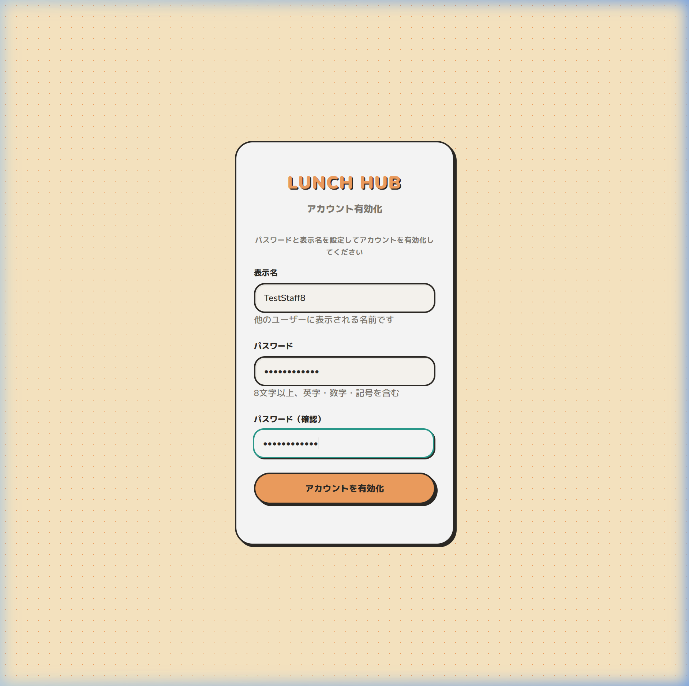
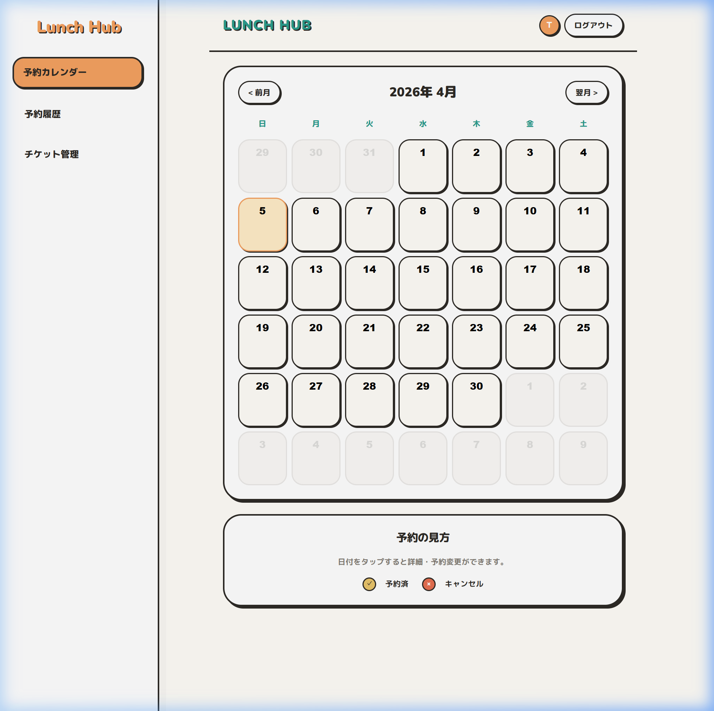
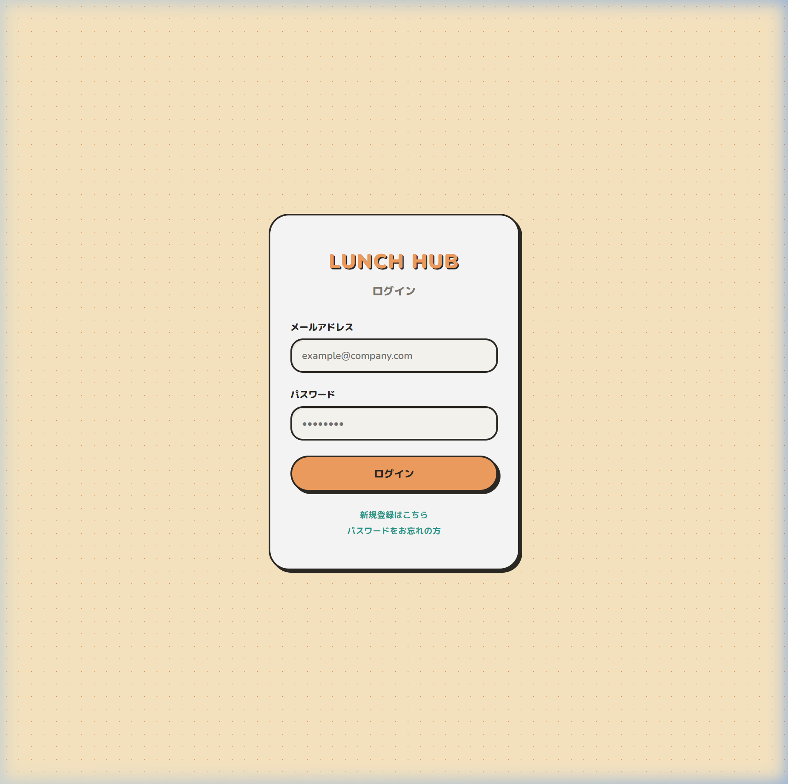
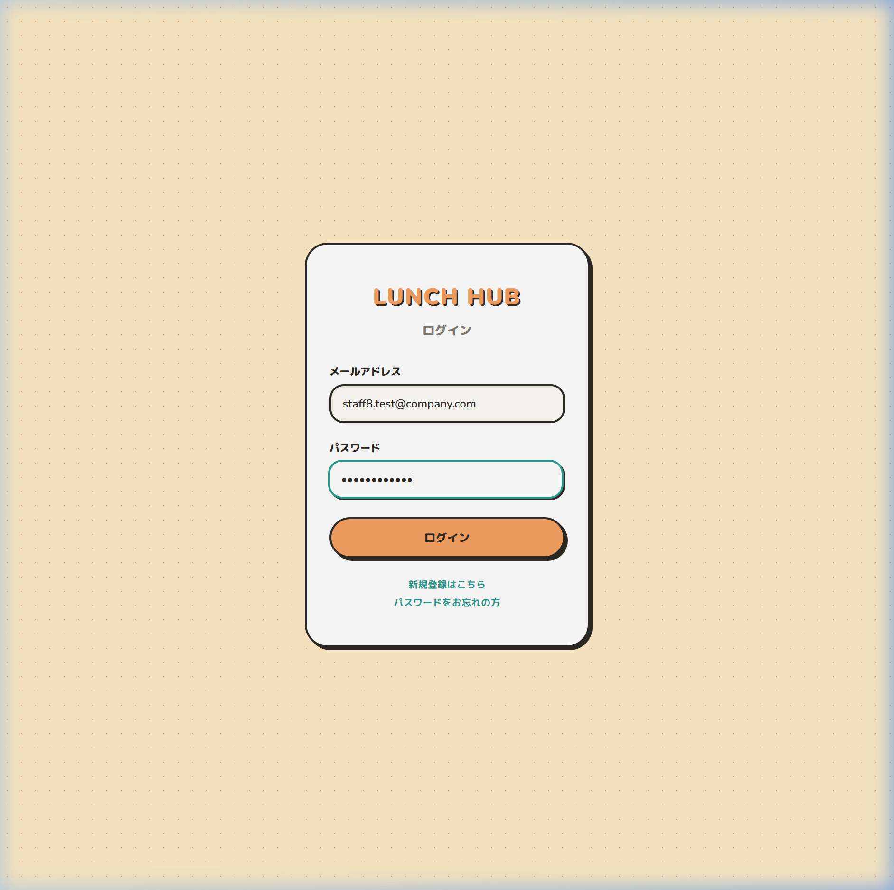
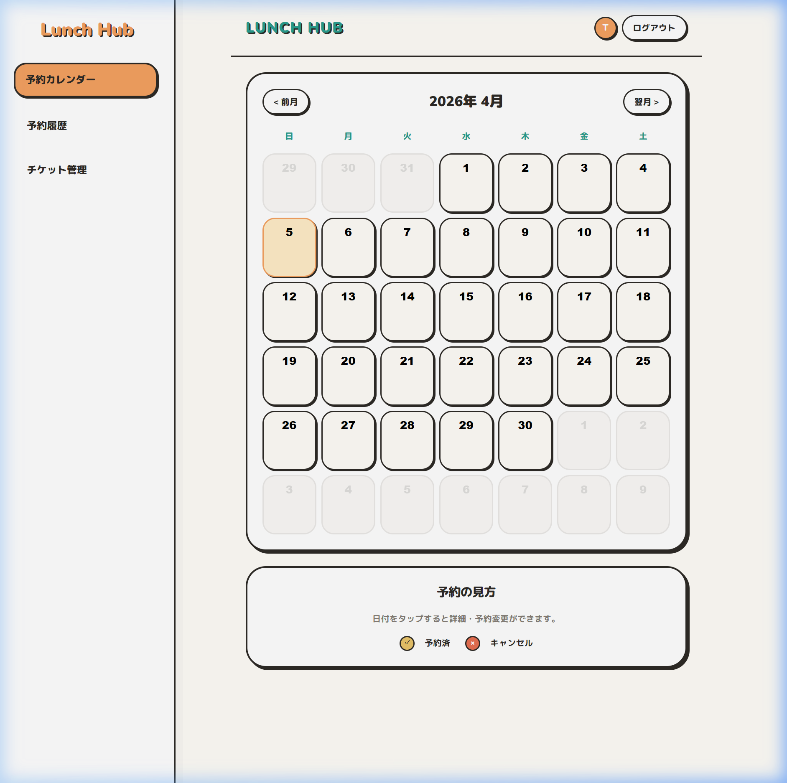

# TC-01: 初回登録〜ログインフロー エビデンス報告書

**テスト実施日時**: 2026-04-05
**対象テストケース**: TC-01 (manual-e2e-spec.md 参照)
**テスト対象ユーザー**: staff8.test@company.com

本ドキュメントは、TC-01 の E2E テストシナリオが期待通りに動作することを確認するためのエビデンス（入力状態および実行結果のスクリーンショット）をまとめたものです。

---

## 1. 管理者ログイン (Step 1〜3)

管理者がシステムへログインするための認証情報を入力した状態と、その後のログイン成功結果です。

**[Before] 管理者ログイン情報入力:**

**[After] ログイン完了・遷移:**

---

## 2. ユーザー招待の送信 (Step 4〜6)

ユーザー管理画面から新しいユーザー（`staff8.test@company.com`）のメールアドレスを入力した状態と、送信後のリスト反映結果です。

**[Before] メールアドレス入力状態:**

**[After] 招待メール送信完了:**
リストに「招待中」ステータスが表示されていることが確認できます。

---

## 3. 招待メールの受信確認 (Step 7〜9)

メールサーバー (MailHog) を確認し、送信された招待メールとその内部の有効化リンクが正常に届いていることを確認しました。

**[After] メール受信内容:**

---

## 4. アカウント有効化と自動ログイン (Step 10〜12)

メール内部の有効化リンクを開き、ユーザー自身が表示名（`TestStaff8`）と新パスワードを入力した状態と、送信後の結果です。

**[Before] 有効化情報入力状態:**

**[After] 有効化完了・自動ログイン:**
完了後、認証情報が反映されて一般ユーザーの初期画面（カレンダー）に遷移・表示されました。

---

## 5. ログアウトの確認 (Step 13)

一度ログアウトボタンを押下し、セッションが破棄されることを確認しました。

**[After] ログアウト後状態:**

---

## 6. 新規ユーザーでの再ログイン (Step 14〜15)

有効化を終えたパスワードを使用して作成したてのアカウントでログインし、ダッシュボードへアクセスできるか確認しました。

**[Before] 新規アカウントログイン情報入力:**

**[After] 新規アカウントログイン成功:**
ヘッダー名が新名称（`TestStaff8`）等になり、本人の権限で閲覧できていることを確認しました。

---

### テスト結果: PASS
上記すべての手順においてエラーはなく、全テストデータが正しく入力・処理され、`08-test/manual-e2e-spec.md` に記載された TC-01 のすべての期待結果を満たしていることを実証しました。
