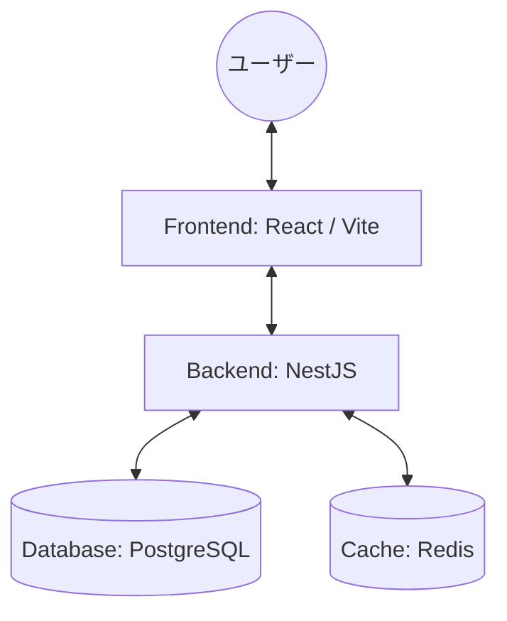
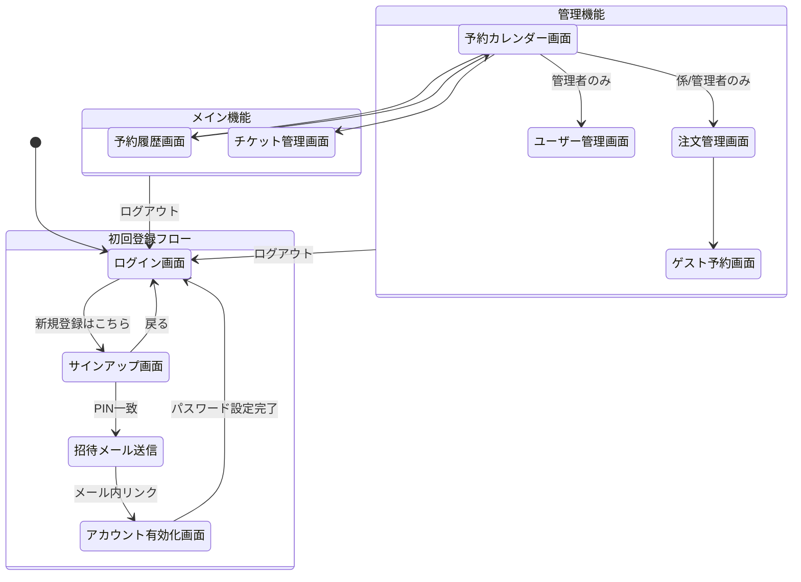

# Lunch Hub 基本設計書

## 1. システム概要
Lunch Hubは、社内の弁当注文およびチケット管理を効率化するためのWebアプリケーションです。

### 1.1 システム構成
Docker環境を利用し、以下の構成で動作します。

---

## 2. 画面設計

### 2.1 画面一覧
| ID     | 画面名               | 説明                                 | 権限                 |
| :----- | :------------------- | :----------------------------------- | :------------------- |
| P-001  | ログイン画面         | メールアドレスとパスワードでログイン | 全員                 |
| P-001b | サインアップ画面     | PINとメールアドレスで登録申請を行う  | 未登録社員           |
| P-002  | アカウント有効化画面 | 招待メールから初回パスワードを設定   | 招待中ユーザー       |
| P-101  | 予約カレンダー画面   | 弁当の予約作成、変更、確認           | 全員                 |
| P-102  | 予約履歴画面         | 過去・未来の予約一覧の確認           | 全員                 |
| P-201  | チケット管理画面     | チケット購入予約、残高確認           | 全員                 |
| P-301  | 注文管理画面         | 日別の注文数集計、確定操作           | STAFF, ADMINISTRATOR |
| P-302  | ゲスト予約画面       | ゲスト用の代理予約作成               | STAFF, ADMINISTRATOR |
| P-401  | ユーザー管理画面     | ユーザー招待、ロール変更、無効化     | ADMINISTRATOR        |

### 2.2 画面遷移図

---

## 3. 機能一覧

### 3.1 認証・認可機能
- **ログイン/ログアウト**: セッション管理を含む
- **ユーザー招待**: 管理者によるメール招待
- **アカウント有効化**: 初回パスワード設定
- **パスワード管理**: 変更およびリセット

### 3.2 予約管理機能
- **弁当予約作成**: カレンダーからの予約（当日9:30締切）
- **予約変更/キャンセル**: 締切前の操作
- **予約確認**: カレンダーおよび一覧形式

### 3.3 チケット管理機能
- **チケット購入予約**: 10枚セットの購入申請
- **受取確認**: 係による受取承認
- **チケット使用**: 予約時の支払い方法指定

### 3.4 注文管理機能（職能用）
- **注文集計**: 日別の合計数および内訳の確認
- **注文確定**: 9:30の自動/手動締め切り処理
- **ゲスト予約**: ゲスト名の代理予約（現金のみ）

---

## 4. 参照リンク
より詳細な設計については、以下の各ドキュメントを参照してください。
- [詳細設計書（作成予定）](./detailed-design.md)
- [要件定義書](./requirements.md)
- [アーキテクチャ設計書](./architecture.md)
- [ドメインモデル設計書](./domain-model.md)
