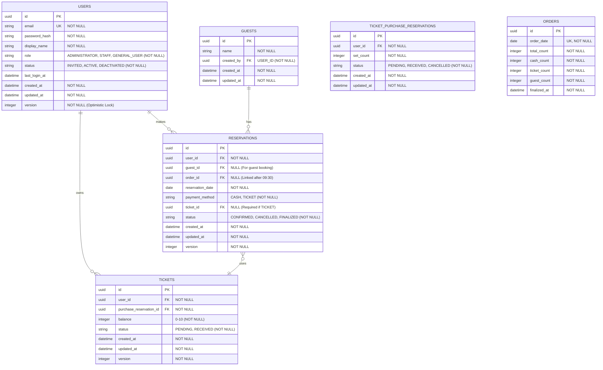
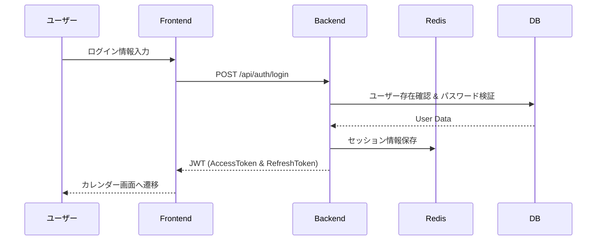

# Lunch Hub 詳細設計書

## 1. データベース設計 (物理設計)

### 1.1 エンティティ関係図 (ERD)


---

## 2. API設計

### 2.1 認証関連 (IAM)
| Method | Path                   | Description                       | Roles  |
| :----- | :--------------------- | :-------------------------------- | :----- |
| POST   | `/api/auth/login`      | ログイン (JWT発行)                | Public |
| POST   | `/api/auth/signup`     | サインアップ申請 (PIN要)          | Public |
| POST   | `/api/auth/invitation` | ユーザー招待メール送信 (管理者用) | Admin  |
| POST   | `/api/auth/activate`   | アカウント有効化                  | Public |
| POST   | `/api/auth/logout`     | ログアウト                        | Auth   |

### 2.2 予約関連
| Method | Path                    | Description        | Roles |
| :----- | :---------------------- | :----------------- | :---- |
| GET    | `/api/reservations`     | 自分の予約一覧取得 | Auth  |
| POST   | `/api/reservations`     | 予約作成           | Auth  |
| DELETE | `/api/reservations/:id` | 予約キャンセル     | Auth  |

---

## 3. 主要ユースケース処理仕様

ここでは、各APIが実行する具体的な処理ステップを定義します。

### 3.1 ログイン (Auth Module)
1.  **レート制限チェック**: Redisを参照し、短時間での試行回数超過(10回/15分)ならエラー。
2.  **ユーザー検索**: `email` をキーにDBからユーザーを取得。
3.  **状態検証**: ユーザーが `ACTIVE` か確認。
4.  **パスワード検証**: `bcrypt.compare` でハッシュを照合。
5.  **トークン生成**: `accessToken`(15m) と `refreshToken`(7d) を発行。
6.  **セッション保存**: Redisにセッション情報を保存し、以前のセッションを無効化。
7.  **最終ログイン更新**: `lastLoginAt` を現在時刻(JST)で更新。

### 3.1b サインアップ (Auth Module)
1.  **入力バリデーション**: `email` と `pin` の形式をチェック。
2.  **PIN検証**: 入力された `pin` がシステム設定（環境変数）の `COMPANY_PIN` と一致するか確認。
3.  **重複チェック**: 既にその `email` でユーザー（`ACTIVE` または `INVITED`）が存在しないか確認。
4.  **ユーザー仮登録**:
    - `role = GENERAL_USER`, `status = INVITED` としてユーザーレコードを作成。
    - 招待用トークン（UUID）を生成し、有効期限(48h)と共に保存。
5.  **メール送信**: 招待用リンクを含むメールを送信。

### 3.1c アカウント有効化 (Auth Module)
1.  **トークン検証**: URLパラメータの `token` をキーにDBで招待中ユーザーを検索。期限切れや存在しない場合はエラー。
2.  **入力バリデーション**: `password` (ポリシー準拠) と `displayName` の形式をチェック。
3.  **パスワードハッシュ化**: `bcrypt.hash` でハッシュを生成。
4.  **ユーザー情報更新**:
    - `passwordHash`, `displayName` を保存。
    - `status = ACTIVE` に変更。
    - `invitationToken` を無効化（削除または使用済みフラグ）。
5.  **セッション発行 (任意)**: 自動ログインさせる場合はそのままJWTを発行、そうでない場合はログイン画面へ誘導。

### 3.2 弁当予約作成 (Reservation Module)
1.  **重複チェック**: 同一ユーザーによる同一日の重複予約がないか確認。
2.  **日付バリデーション**: 予約日が「当日09:30:00以前」かつ「現在から翌月末まで」か。
3.  **締切判定**: 当日の予約の場合、JST 09:30:00を1秒でも過ぎていたら予約不可。
4.  **支払い方法処理**:
    - **チケット払いの場合**: 
        - 有効なチケット（`RECEIVED` 状態）かつ残高があるものを検索。
        - チケット残高を1減らし、DBを更新（Optimistic Lockingによる競合回避）。
    - **現金払いの場合**: ステータスを `CONFIRMED` で作成。
5.  **予約登録**: UUID v4をアプリケーション層で生成し、予約エンティティを作成しDB保存。

### 3.3 共通仕様
- **タイムゾーン**: 全て JST (Asia/Tokyo) とし、DB保存時はUTC変換、取得時にJST変換を行う（またはJST固定）。
- **UUID**: v4を標準とし、Application Layerで生成してDomainモデルに渡す。
- **同時実行制御**: Aggregates (User, Ticket, Reservation) には `version` カラムを持たせ、TypeORMの `@VersionColumn` を利用した楽観的ロックを行う。
- **バリデーション**:
    - `DisplayName`: `/^[a-zA-Z0-9\u3040-\u309F\u30A0-\u30FF\u4E00-\u9FFF\u30FC\u30FB ]+$/` (日本語、英数字、長音、中点、スペース)
    - `Password`: 最低8文字、英字・数字・記号(`!@#$%^&*`から1文字以上)必須。

### 3.5 社員用共通PIN (Company PIN) 仕様
- **形式**: 英数字混合、6文字以上12文字以内（例: `LH2024HUB`）
- **管理方法**: 
    - サーバーサイドの環境変数 `COMPANY_PIN` に平文で保持。
    - サインアップリクエスト時、`bcrypt.compare` もしくは単純な文字列比較（定数時間比較推奨）で検証。
- **セキュリティ**:
    - ブルートフォース対策として、PIN入力ミスにもログインと同様のレート制限（10回/15分）を適用。
    - PINは定期的に（例：四半期ごと）変更し、全社員に周知する運用を想定。

### 3.4 エラーコード定義例
| コード                        | 内容               | HTTP Status |
| :---------------------------- | :----------------- | :---------- |
| `AUTH_INVALID_CREDENTIALS`    | 認証失敗           | 401         |
| `AUTH_LOCKED_OUT`             | アカウントロック中 | 429         |
| `RESERVATION_DUPLICATE`       | 重複予約           | 409         |
| `RESERVATION_DEADLINE_PASSED` | 締め切り超過       | 400         |
| `TICKET_INSUFFICIENT_BALANCE` | チケット残高不足   | 400         |
| `PERMISSION_DENIED`           | 権限不足           | 403         |
| `RESOURCE_NOT_FOUND`          | データ未存在       | 404         |

### 3.3 チケット受取確認 (Ticket Module)
1.  **権限チェック**: 操作者が `STAFF` または `ADMIN` か。
2.  **状態遷移**: チケットステータスを `PENDING` → `RECEIVED` に変更。
3.  **通知（任意）**: ユーザーに受取完了を通知。

### 3.4 注文確定・締め切り (Order Module)
1.  **トリガー**: 定時（9:30）または手動。
2.  **集計**: 当日分の `CONFIRMED` 状態の予約を全て抽出。
3.  **内訳計算**: 現金合計、チケット合計、ゲスト合計を計算。
4.  **ロック**: 対象の予約を編集不可（`status = FINALIZED`）に変更。

## 4. メールテンプレート設計

### 4.1 ユーザー招待 / アカウント有効化メール
サインアップ申請（PIN一致後）に送信されるメールです。

- **件名**: 【Lunch Hub】アカウント登録のご案内
- **本文**:
  ```text
  Lunch Hub をご利用いただきありがとうございます。
  以下のリンクよりパスワードを設定し、アカウントを有効化してください。

  https://lunch-hub.example.com/activate?token={{token}}

  ※リンクの有効期限は送信から48時間です。
  ※本メールに心当たりがない場合は、破棄してください。
  ```

### 4.2 パスワードリセットメール
パスワード忘却時のリセット申請で送信されるメールです。

- **件名**: 【Lunch Hub】パスワード再設定のご案内
- **本文**:
  ```text
  パスワードの再設定リクエストを受け付けました。
  以下のリンクより新しいパスワードを設定してください。

  https://lunch-hub.example.com/reset-password?token={{token}}

  ※リンクの有効期限は送信から1時間です。
  ※再設定を行わない場合、現在のパスワードが引き続き有効です。
  ```

---

## 4. シーケンス図

### 3.1 ログインフロー


---

## 4. 参照リンク
- [ドメインモデル設計書](./domain-model.md)
- [アーキテクチャ設計書](./architecture.md)
