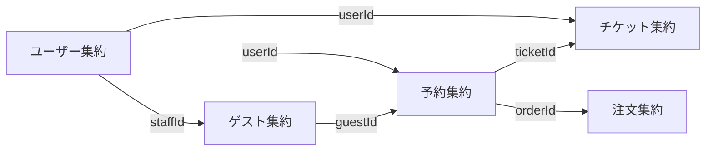
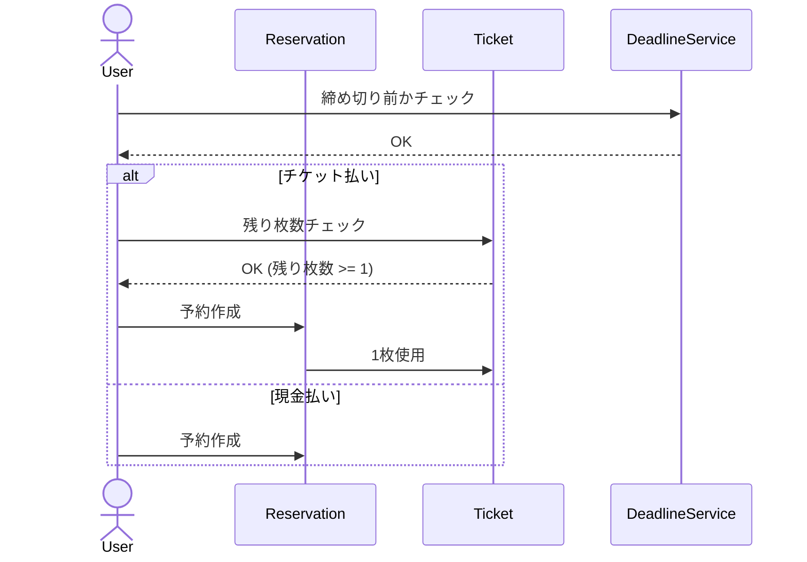
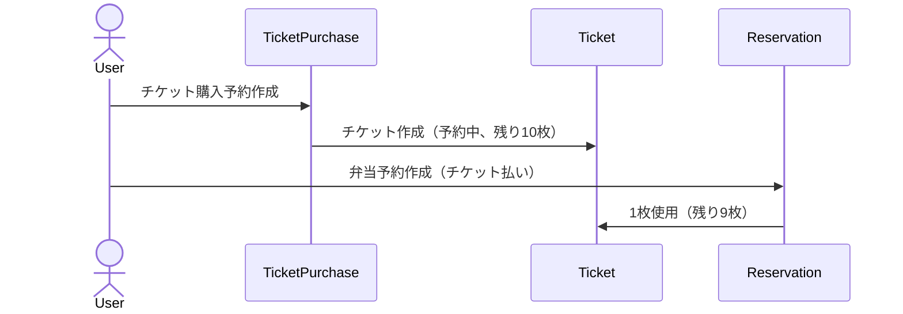
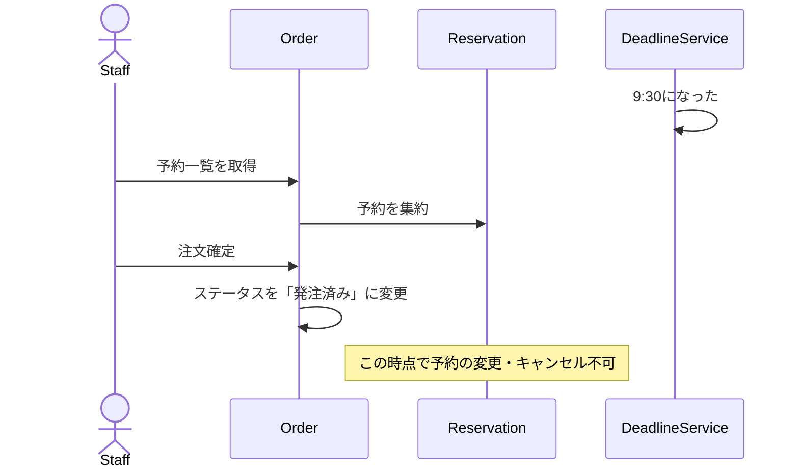

# ドメインモデル図

> このドキュメントは、Lunch-Hub システムのドメインモデルを視覚化し、エンティティ、値オブジェクト、集約、およびそれらの関係を定義します。

---

## 📊 ドメインモデル全体図

```mermaid
classDiagram
    %% ユーザー集約
    class User {
        +UUID userId
        +DisplayName displayName
        +EmailAddress emailAddress
        +Password password
        +Role role
        +DateTime createdAt
        +DateTime lastLoginAt
        +Boolean isActive
        +login()
        +logout()
        +hasPermission()
    }

    class Role {
        <<enumeration>>
        GENERAL_USER
        STAFF
        ADMINISTRATOR
    }

    %% 予約集約
    class Reservation {
        +UUID reservationId
        +UUID userId
        +Date reservationDate
        +PaymentMethod paymentMethod
        +ReservationStatus status
        +DateTime createdAt
        +DateTime updatedAt
        +cancel()
        +canModify()
        +isBeforeDeadline()
    }

    class ReservationStatus {
        <<enumeration>>
        CONFIRMED
        CANCELLED
        FINALIZED
    }

    class PaymentMethod {
        <<enumeration>>
        CASH
        TICKET
    }

    %% 注文集約
    class Order {
        +UUID orderId
        +Date orderDate
        +List~Reservation~ reservations
        +OrderStatus status
        +Integer totalCount
        +DateTime createdAt
        +placeOrder()
        +canModify()
        +getTotalCount()
    }

    class OrderStatus {
        <<enumeration>>
        PENDING
        PLACED
    }

    %% チケット集約
    class Ticket {
        +UUID ticketId
        +UUID ownerId
        +TicketCount remainingCount
        +TicketStatus status
        +Date purchaseDate
        +use()
        +restoreCount()
        +canUse()
    }

    class TicketStatus {
        <<enumeration>>
        PENDING
        RECEIVED
    }

    class TicketPurchaseReservation {
        +UUID purchaseReservationId
        +UUID userId
        +Date purchaseDate
        +TicketSetQuantity quantity
        +PurchaseStatus status
        +DateTime createdAt
        +getTotalTickets()
        +cancel()
    }

    class PurchaseStatus {
        <<enumeration>>
        PENDING
        RECEIVED
        CANCELLED
    }

    %% ゲスト
    class Guest {
        +UUID guestId
        +String guestName
        +UUID createdByStaffId
        +Date visitDate
    }

    %% 値オブジェクト
    class DisplayName {
        <<value object>>
        +String value
        +isValid()
        +equals()
    }

    class EmailAddress {
        <<value object>>
        +String value
        +isValid()
        +equals()
    }

    class Password {
        <<value object>>
        +String hashedValue
        +verify()
        +meetsRequirements()
    }

    class TicketCount {
        <<value object>>
        +Integer value
        +isValid()
        +decrement()
        +increment()
        +add()
        +canUse()
    }

    class TicketSetQuantity {
        <<value object>>
        +Integer sets
        +getSets()
        +getTotalTickets()
        +equals()
    }

    class DeadlineTime {
        <<value object>>
        +Time time
        +isPassed()
    }

    class ReservationPeriod {
        <<value object>>
        +Date startDate
        +Date endDate
        +isWithinPeriod()
    }

    %% 関係性
    User "1" --> "1" DisplayName : has
    User "1" --> "1" EmailAddress : has
    User "1" --> "1" Password : has
    Ticket "1" --> "1" TicketCount : has
    TicketPurchaseReservation "1" --> "1" TicketSetQuantity : has
    User "1" --> "1" Role : has
    User "1" --> "0..*" Reservation : makes
    User "1" --> "0..*" Ticket : owns
    User "1" --> "0..*" TicketPurchaseReservation : makes
    User "1" --> "0..*" Guest : creates (staff only)

    Reservation "1" --> "1" PaymentMethod : uses
    Reservation "1" --> "1" ReservationStatus : has
    Reservation "*" --> "1" Order : belongs to
    Reservation "0..1" --> "1" Ticket : uses (if ticket payment)

    Order "1" --> "1" OrderStatus : has
    Order "1" --> "1" DeadlineTime : respects

    Ticket "1" --> "1" TicketStatus : has
    Ticket "1" <-- "1" TicketPurchaseReservation : creates

    Guest "1" --> "0..*" Reservation : has

    Reservation --> ReservationPeriod : within
```



---

## 🏗️ 集約（Aggregate）の定義

DDDでは、関連するエンティティと値オブジェクトを**集約**としてグループ化します。各集約には**集約ルート**があり、外部からはこのルートを通じてのみアクセスします。

### 1. ユーザー集約 (User Aggregate)

**集約ルート:** `User`

**含まれるオブジェクト:**
- User（エンティティ）
- Role（値オブジェクト）

**責務:**
- ユーザーの認証・認可
- ユーザー情報の管理
- ロールに基づく権限チェック

**不変条件:**
- メールアドレスは一意
- ロールは1つのみ
- 無効化されたユーザーはログイン不可

---

### 2. 予約集約 (Reservation Aggregate)

**集約ルート:** `Reservation`

**含まれるオブジェクト:**
- Reservation（エンティティ）
- PaymentMethod（値オブジェクト）
- ReservationStatus（値オブジェクト）
- ReservationPeriod（値オブジェクト）

**責務:**
- 弁当予約の作成・変更・キャンセル
- 締め切り時刻のチェック
- 支払い方法の管理

**不変条件:**
- 予約は1つの日付に紐づく
- 予約は1つの支払い方法を持つ
- 締め切り時刻を過ぎた予約は変更・キャンセル不可
- チケット払いの場合、チケットの残り枚数が1以上必要

---

### 3. 注文集約 (Order Aggregate)

**集約ルート:** `Order`

**含まれるオブジェクト:**
- Order（エンティティ）
- OrderStatus（値オブジェクト）
- DeadlineTime（値オブジェクト）

**責務:**
- 複数の予約を取りまとめる
- お弁当屋さんへの発注管理
- 注文の確定

**不変条件:**
- 注文は1つの日付に紐づく
- 発注済みの注文に含まれる予約は変更・キャンセル不可
- 締め切り時刻後に注文を確定

---

### 4. チケット集約 (Ticket Aggregate)

**集約ルート:** `Ticket`

**含まれるオブジェクト:**
- Ticket（エンティティ）
- TicketPurchaseReservation（エンティティ）
- TicketStatus（値オブジェクト）
- PurchaseStatus（値オブジェクト）

**責務:**
- チケットの購入予約
- チケットの使用・返却
- 残り枚数の管理

**不変条件:**
- チケットの残り枚数は0以上（上限なし）
- チケット購入予約をすると、即座に「予約中」状態のチケットが作成される
- 予約中のチケットでも弁当予約に使用可能
- チケット購入予約をキャンセルした場合、そのチケットで使用した弁当予約も全てキャンセルされる

---

### 5. ゲスト集約 (Guest Aggregate)

**集約ルート:** `Guest`

**含まれるオブジェクト:**
- Guest（エンティティ）

**責務:**
- 社外訪問者の情報管理
- 係による代理予約

**不変条件:**
- ゲストは係のみが作成可能
- ゲストは自分でログインできない

---

## 🔗 集約間の関係

### 参照の方向



**重要な原則:**
- 集約間の参照は**IDのみ**を使用（オブジェクト参照は避ける）
- 集約の境界を越えた整合性は**結果整合性**で管理
- トランザクションは1つの集約内で完結

---

## 📝 エンティティ vs 値オブジェクト

### エンティティ（Identity を持つ）
- **User**: ユーザーID で識別
- **Reservation**: 予約ID で識別
- **Order**: 注文ID で識別
- **Ticket**: チケットID で識別
- **Guest**: ゲストID で識別

### 値オブジェクト（値で識別）

#### 列挙型
- **Role**: 列挙型（GENERAL_USER, STAFF, ADMINISTRATOR）
- **PaymentMethod**: 列挙型（CASH, TICKET）
- **ReservationStatus**: 列挙型（CONFIRMED, CANCELLED, FINALIZED）
- **OrderStatus**: 列挙型（PENDING, PLACED）
- **TicketStatus**: 列挙型（PENDING, RECEIVED）

#### ビジネスルールを持つ値オブジェクト

**DisplayName（表示名）**
- **責務**: ユーザーの表示名の検証と正規化
- **バリデーション**:
  - 1文字以上50文字以内
  - 空文字・空白のみは不可
  - 使用可能文字: 日本語（ひらがな、カタカナ、漢字）、英数字、スペース、中点（・）、長音（ー）のみ
  - 絵文字、特殊記号、HTMLタグなどは不可
- **振る舞い**:
  - `isValid()`: 文字種と文字数のチェック
  - `equals()`: 等価性チェック
- **セキュリティ**: XSS攻撃やデータ破損を防ぐため、使用可能文字を制限

**EmailAddress（メールアドレス）**
- **責務**: メールアドレスの形式検証と正規化
- **バリデーション**:
  - メール形式（`user@domain.com`）
  - `@` と `.` が必須
  - 空白文字を含まない
- **振る舞い**:
  - `isValid()`: 形式チェック
  - `equals()`: 等価性チェック（小文字に正規化して比較）

**Password（パスワード）**
- **責務**: パスワードのセキュリティ要件とハッシュ化
- **バリデーション**:
  - 最小8文字以上
  - 英数字を含む（推奨）
- **振る舞い**:
  - `verify()`: パスワード検証
  - `meetsRequirements()`: セキュリティ要件チェック
- **注意**: 値はハッシュ化して保存

**TicketCount（チケット枚数）**
- **責務**: チケット残り枚数の管理と不変条件の保証
- **不変条件**: 0以上（上限なし）
- **振る舞い**:
  - `isValid()`: 範囲チェック（0以上）
  - `decrement()`: 1枚減らす（0枚の場合はエラー）
  - `increment()`: 1枚増やす
  - `add(count)`: 指定枚数を追加（チケット購入時）
  - `canUse()`: 使用可能かチェック（残り枚数 > 0）
- **注意**: 不変オブジェクト（変更時は新しいインスタンスを返す）

**TicketSetQuantity（チケットセット数）**
- **責務**: チケット購入時のセット数管理と枚数計算
- **不変条件**: 
  - 1セット以上
  - 整数のみ
  - 1セット = 10枚固定
- **振る舞い**:
  - `getSets()`: セット数を取得
  - `getTotalTickets()`: 合計枚数を計算（セット数 × 10）
  - `equals()`: 等価性チェック
- **ビジネスルール**: チケットは10枚セット単位でのみ購入可能
- **例**: 3セット購入 → 30枚のチケットが付与される

**DeadlineTime（締め切り時刻）**
- **責務**: 注文締め切り時刻（9:30）の管理
- **固定値**: 9時30分
- **振る舞い**:
  - `isPassed()`: 現在時刻が締め切りを過ぎているかチェック

**ReservationPeriod（予約可能期間）**
- **責務**: 予約可能期間（現在〜翌月末）の管理
- **範囲**: 現在日〜翌月末
- **振る舞い**:
  - `isWithinPeriod()`: 指定日が期間内かチェック

---

## 🎯 ドメインサービス

集約に属さないビジネスロジックは**ドメインサービス**として実装します。

### 1. ReservationDeadlineService
**責務:** 締め切り時刻のチェック

```typescript
class ReservationDeadlineService {
  canModifyReservation(reservation: Reservation): boolean {
    // 当日9:30より前かチェック
  }
}
```

### 2. TicketUsageService
**責務:** チケットの使用・返却ロジック

```typescript
class TicketUsageService {
  useTicket(ticket: Ticket, reservation: Reservation): void {
    // チケットの残り枚数を減らす
  }
  
  restoreTicketCount(ticket: Ticket, reservation: Reservation): void {
    // チケットの残り枚数を増やす（予約キャンセル時など）
  }
}
```

### 3. OrderAggregationService
**責務:** 予約を注文にまとめる

```typescript
class OrderAggregationService {
  createOrder(reservations: Reservation[], orderDate: Date): Order {
    // 複数の予約から注文を作成
  }
}
```

---

## 🔄 主要なビジネスフロー

### 1. 弁当予約フロー



### 2. チケット購入 + 弁当予約の同時フロー



### 3. 注文確定フロー



---

## 📌 まとめ

このドメインモデルは以下を定義しています：

1. **5つの集約**: User, Reservation, Order, Ticket, Guest
2. **エンティティと値オブジェクト**の区別
3. **集約間の関係**（IDによる参照）
4. **ドメインサービス**（集約に属さないロジック）
5. **主要なビジネスフロー**

次のステップでは、これらの集約を**境界づけられたコンテキスト**にグループ化します。

---

**更新履歴:**
- 2025-11-30: 初版作成
